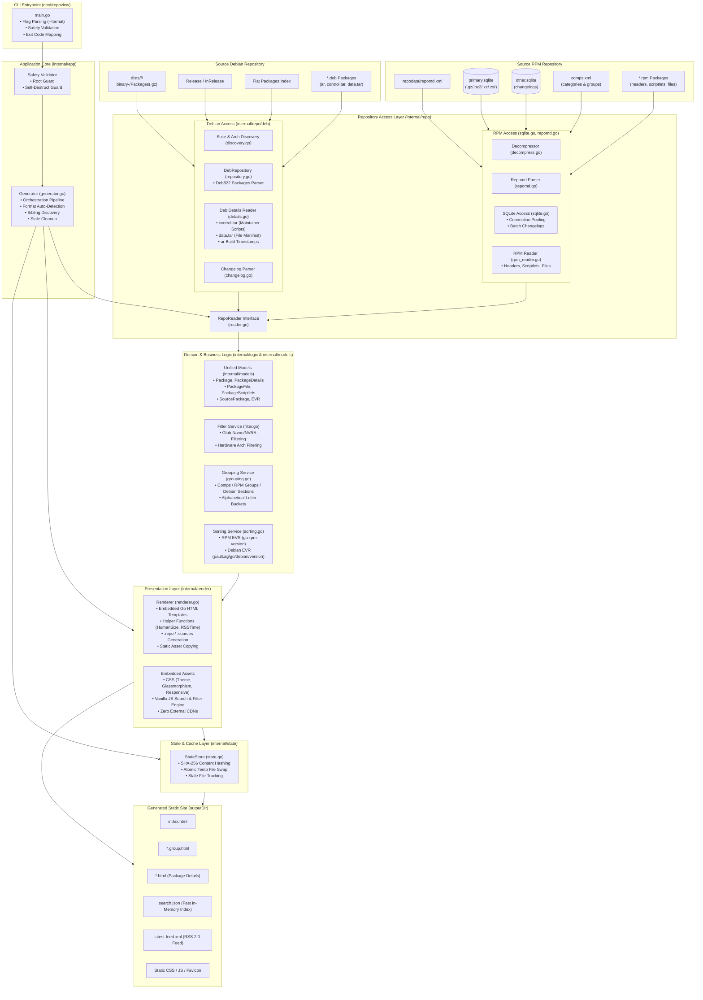
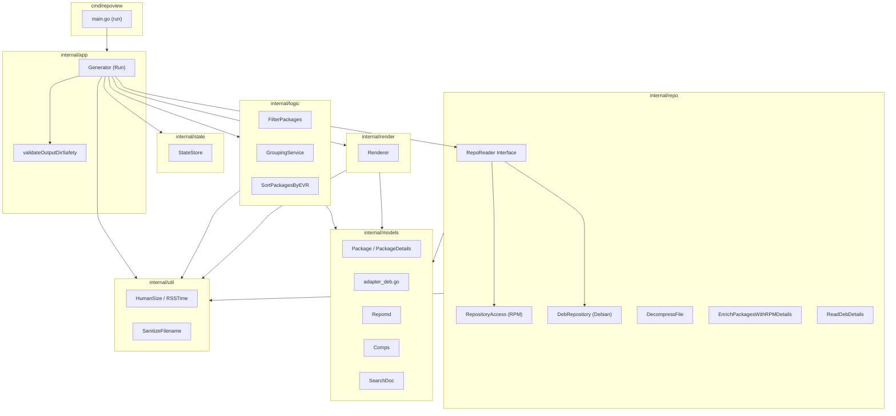
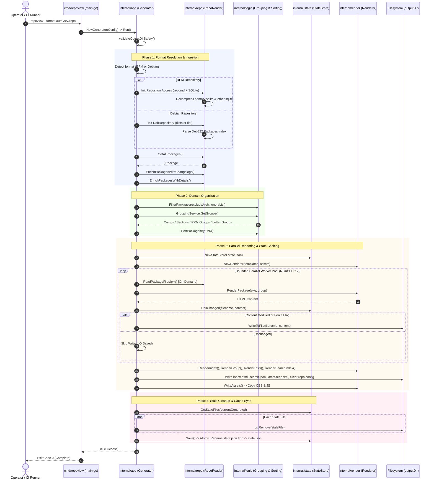
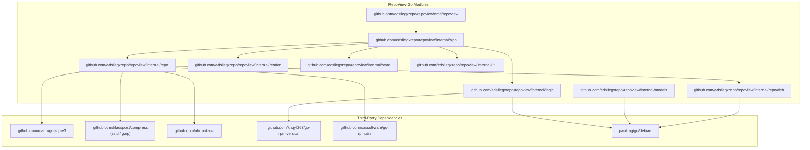
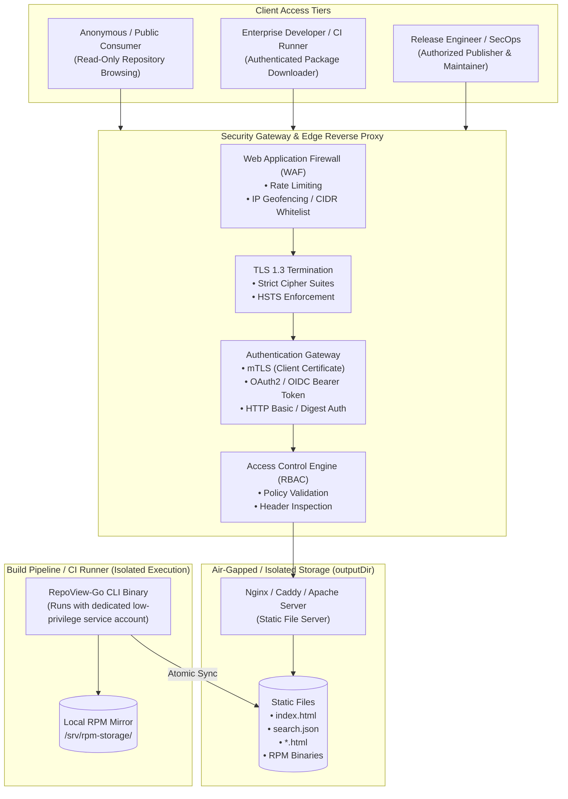

# RepoView-Go System Architecture Document

Architectural specification, technical design choices, concurrency patterns, security model, and component interactions for **RepoView-Go**.

---

## Table of Contents

1. [Architecture and Design Choices](#1-architecture-and-design-choices)
   - [High-Level Architecture Diagram](#high-level-architecture-diagram)
   - [Modular Directory Structure](#modular-directory-structure)
   - [Architectural Design Patterns](#architectural-design-patterns)
   - [Core Design Principles & Paradigms](#core-design-principles--paradigms)
   - [Foundational Assumptions](#foundational-assumptions)
   - [Edge Case Handling](#edge-case-handling)
   - [Performance & Efficiency Engineering](#performance--efficiency-engineering)
2. [Data Flow and Control Logic](#2-data-flow-and-control-logic)
   - [End-to-End Operational Flow](#end-to-end-operational-flow)
   - [Code Relations and Package Interaction](#code-relations-and-package-interaction)
   - [System Sequence Diagram](#system-sequence-diagram)
3. [Performance and Scalability](#3-performance-and-scalability)
   - [Concurrency Model & Goroutine Worker Pool](#concurrency-model--goroutine-worker-pool)
   - [Channel Structures & Synchronization Primitives](#channel-structures--synchronization-primitives)
   - [Memory Footprint & Heap Allocation Optimization](#memory-footprint--heap-allocation-optimization)
   - [SQLite Connection Pooling & Prepared Statement Caching](#sqlite-connection-pooling--prepared-statement-caching)
4. [Dependencies](#4-dependencies)
   - [Runtime Modules & External Libraries](#runtime-modules--external-libraries)
   - [Build Tooling & System Dependencies](#build-tooling--system-dependencies)
   - [Package Dependency Diagram](#package-dependency-diagram)
5. [Security Architecture](#5-security-architecture)
   - [Static Site Generation Security Paradigm](#static-site-generation-security-paradigm)
   - [Generator Defenses & Input Sanitization](#generator-defenses--input-sanitization)
   - [Serving Layer Security Architecture](#serving-layer-security-architecture)
   - [Authentication Layers & Supported Methods](#authentication-layers--supported-methods)
   - [Role-Based Access Control (RBAC) Matrix](#role-based-access-control-rbac-matrix)
   - [Security Architecture Diagram](#security-architecture-diagram)

---

## 1. Architecture and Design Choices

RepoView-Go is a high-performance, air-gap compliant static site generator engineered to transform RPM repository metadata (`repodata/`) and Debian repository metadata (`dists/` or flat indices) into a modern, responsive, and easily navigable web portal.

### High-Level Architecture Diagram



### Modular Directory Structure

The application follows a clean, modular architecture separating concerns between data access, domain business logic, state caching, and presentation:

- **`cmd/repoview`**: Entry point and CLI frontend. Handles long-only argument parsing, flag accumulation, directory validation, and exit code mapping before invoking the orchestration layer.
- **`internal/app`**: Core orchestration layer. The `Generator` struct manages the end-to-end workflow: repository safety validation, metadata loading, package filtering, group tree organization, sibling discovery, parallel rendering scheduling, and stale file cleanup.
- **`internal/repo`**: Data Access Layer (DAL). Unifies package repository access through the `RepoReader` interface:
  - **`reader.go`**: Defines the format-agnostic `RepoReader` abstraction (`GetAllPackages`, `EnrichPackagesWithDetails`, `EnrichPackagesWithChangelogs`, `ReadPackageFiles`, `Close`).
  - **RPM Access (`sqlite.go`, `repomd.go`, `rpm_reader.go`)**: Parses `repomd.xml`, decompresses metadata archives, queries `primary.sqlite`/`other.sqlite` with connection pooling and chunked changelog queries, and inspects `.rpm` headers.
  - **Debian Access (`internal/repo/deb`)**: Discovers `dists/<suite>/<component>/binary-<arch>` layouts and flat trees, streams RFC 822 `Packages` indexes via `pault.ag/go/debian`, extracts maintainer scripts from `control.tar`, extracts file manifests from `data.tar`, parses `changelog.Debian.gz`, and extracts package build timestamps directly from `ar` member headers.
- **`internal/logic`**: Domain and Business Logic Layer. Contains:
  - **Grouping**: Organizes packages by Comps categories/groups, RPM header groups with heuristic inference, Debian section taxonomies (`admin`, `devel`, `net`, `web`, etc.), and alphabetical letter buckets.
  - **Sorting**: Implements dual EVR comparison semantics—RPM EVR via `go-rpm-version` and Debian EVR via `pault.ag/go/debian/version`.
  - **Filtering**: Applies glob-based package name/NVRA matching and hardware architecture exclusions (`--ignore-package`, `--exclude-arch`).
- **`internal/render`**: Presentation Layer. Renders HTML5 pages, RSS 2.0 feeds, search indices, and client configuration snippets (`.repo` for YUM/DNF and Deb822 `.sources` for APT) using Go's standard `html/template`. Layout templates and static assets (CSS, Vanilla JS) are compiled into the binary via `embed.FS`.
- **`internal/state`**: State and Cache Management. Maintains an incremental state store (`.state.json`) with SHA-256 content hashing to avoid redundant disk writes, detect modified pages, and identify stale/orphaned files for pruning.
- **`internal/models`**: Generalized, format-agnostic domain data structures representing repository metadata, packages (`Package`, `PackageDetails`, `PackageFile`, `PackageScriptlets`, `SourcePackage`), dependencies, comps definitions, and search index documents.
- **`internal/util`**: Low-level formatting, temporal conversions (RFC 822 / RFC 1123), binary byte size calculations (KiB, MiB, GiB, TiB), and secure filename sanitization routines.

### Architectural Design Patterns

- **Bounded Worker Pool (Semaphore Pattern)**: The page generation phase leverages a buffered channel semaphore (`sem := make(chan struct{}, NumCPU*2)`) to achieve maximum multi-core parallelism while capping concurrent memory and file descriptor consumption.
- **Dependency Injection & Struct-Based Configuration**: Components (`Generator`, `RepositoryAccess`, `Renderer`, `StateStore`) receive explicit configuration structs, eliminating global state and enabling in-process testing without global side effects.
- **Defensive Input Sanitization**: All filenames, group keys, and URL components derived from untrusted package metadata undergo strict whitelist sanitization (`[a-zA-Z0-9._-]`) to neutralize directory traversal and null-byte injection attacks.
- **Two-Phase Atomic File Commit**: State files and rendered pages are written to temporary sibling files before being atomically renamed into place, guaranteeing resilience against power failures or abrupt termination.

### Core Design Principles & Paradigms

1. **Static Site Generator (SSG) Paradigm**:
   - Rather than serving dynamic requests through an application server with attached databases, RepoView-Go executes ahead-of-time (AOT) batch generation.
   - The resulting output consists strictly of static HTML5, CSS, JSON, and XML files. This completely eliminates runtime attack surfaces, database connection exhaustion, server-side memory leaks, and dynamic query latency.
2. **Air-Gap Compliance (Zero External Network Calls)**:
   - Enterprise repositories frequently reside in high-security, network-isolated environments (e.g., DoD air-gapped enclaves, offline air-cooled datacenters, VPC private subnets).
   - RepoView-Go bundles 100% of its presentation dependencies (fonts, styles, icons, search scripts) as embedded Go assets (`embed.FS`). Zero external requests to CDN fonts, analytics, or third-party CDNs are emitted.
3. **Multi-Format Repository Architecture (RPM & Debian)**:
   - RepoView-Go decouples presentation and organization from underlying packaging formats through a unified `RepoReader` interface.
   - RPM repositories generated across distinct tooling generations (original `createrepo`, modern `createrepo_c`, or DNF/RHEL) are parsed via SQLite and `repomd.xml`.
   - Debian and Ubuntu repositories are ingested via standard `dists/<suite>/<component>/binary-<arch>` structures or flat layouts, with native support for Deb822 indexes and `ar`/`tar` archive inspection.
4. **State-Driven Incremental Builds**:
   - Repository regeneration avoids redundant disk I/O. The `StateStore` tracks SHA-256 content hashes of all generated artifacts. If package metadata has not changed, write operations are omitted, reducing run times by >90% on subsequent updates.
5. **Streaming & Bounded Resident Memory**:
   - For repositories containing tens of thousands of packages, eagerly loading all package file lists into memory triggers catastrophic heap growth. File lists are extracted on-demand during parallel package rendering and released immediately via defer-nulling.

### Foundational Assumptions

- **Repository Structure**: The input target must be a readable directory conforming to standard RPM repository conventions (containing `repodata/` with `repomd.xml`) or Debian repository conventions (containing `dists/` with suite metadata or flat `Packages` indices).
- **Filesystem Permissions**: The user executing `repoview` possesses write permissions to `--output-dir` and `--state-dir`.
- **Operating Environment**: Compiled for Linux or Windows (via WSL or CGo-enabled native build) with access to a C compiler for SQLite3 integration.

### Edge Case Handling

| Domain | Edge Case | Mitigation / Implementation |
| :--- | :--- | :--- |
| **Directory Safety** | User passes `--output-dir .` or `--output-dir /` | `validateOutputDirSafety()` aborts before execution if output directory matches repo directory, is an ancestor/parent, is the filesystem root (`/`), or contains existing `repodata/`. |
| **Path Traversal** | Malicious `repomd.xml` contains `<location href="../../etc/passwd"/>` | `ParseRepomd()` cleans all relative paths and enforces strict directory prefix matching against the repo base. |
| **Metadata Corruption** | Truncated `.state.json` or unreadable SQLite database | `StateStore` catches JSON parsing errors and automatically falls back to an empty cache state; SQLite queries emit structured domain errors and cleanly rollback. |
| **Compression Formats** | Compressed repodata in Gzip, Zstd, XZ, or Bzip2 | Dynamic header magic sniffing detects algorithm regardless of file extension; stream decompression handles truncated archives gracefully. |
| **Missing Groups / Comps** | Repository lacks group categorization file | `GroupingService` implements format-specific fallbacks: (1) Comps XML or Debian Section taxonomies, (2) Heuristic package name inference, (3) Alphabetical initial letter grouping. |
| **EVR Comparisons** | Tildes (`~`), Carets (`^`), and missing Epochs | `CompareEVR()` complies with package specifications: RPM EVR via `go-rpm-version` and Debian EVR via `pault.ag/go/debian/version`. Missing epochs default to 0 without allocation. |
| **Debian Multi-Component** | Multi-suite or multi-component repositories | `DebRepository` discovers all components in `dists/<suite>`, aggregates package indices, and prioritizes concrete architectures over `all`. |
| **Debian Build Dates** | Deb822 lacks explicit build timestamp headers | Extracted directly from the numeric modification timestamp inside the outer `ar` archive container header. |
| **Stale Artifacts** | Packages removed from upstream repository | `Generator.cleanupStale()` cross-references previous state store entries with the current execution and unlinks orphaned HTML/JSON files. |

### Performance & Efficiency Engineering

- **Batch Changelog Processing**: Instead of issuing individual SQLite SELECT queries per package, `enrichBatch()` constructs dynamic parameter blocks querying 500 packages at a time, cutting query overhead by orders of magnitude.
- **Worker Semaphore Concurrency**: Package page rendering executes across a bounded goroutine worker pool sized dynamically to `runtime.NumCPU() * 2`.
- **Allocation-Free Hot Paths**: First-letter extraction, EVR epoch parsing, and relation formatting are optimized to minimize string allocations on the Go garbage collector.

---

## 2. Data Flow and Control Logic

### End-to-End Operational Flow

```text
[1. CLI Entrypoint]
  │   Parse long-only flags (--format auto|rpm|deb), validate paths, map exit codes.
  ▼
[2. Safety Guard Validation & Format Resolution]
  │   Confirm outputDir safety; detect format (repodata/ vs dists/ or Packages).
  ▼
[3. Metadata Ingestion via RepoReader]
  │   RPM: Parse repomd.xml -> Decompress primary & other sqlite -> Batch enrich changelogs.
  │   DEB: Discover suite/component -> Stream Deb822 Packages -> Parse changelogs & ar dates.
  ▼
[4. Categorization & Hierarchy Logic]
  │   RPM: Parse comps.xml / infer RPM groups -> Alphabetical indexing.
  │   DEB: Map Debian sections (admin, devel, net, web, etc.) -> Alphabetical indexing.
  ▼
[5. Parallel Page Rendering (Worker Pool)]
  │   sem := make(chan struct{}, NumCPU * 2)
  │   Render package HTML pages (on-demand file lists) -> HasChanged() hash check -> Write.
  ▼
[6. Static Asset, Feed & Index Generation]
  │   Render index.html, *.group.html, search.json, latest-feed.xml (universal RSS).
  │   Generate client configuration (.repo for RPM, .sources for Debian) & copy embedded assets.
  ▼
[7. Stale File Pruning & State Persistence]
      Identify unreferenced previous files -> os.Remove() -> Atomically save .state.json.
```

### Code Relations and Package Interaction



### System Sequence Diagram



---

## 3. Performance and Scalability

### Concurrency Model & Goroutine Worker Pool

The generation bottleneck in large RPM repositories stems from template execution, disk I/O, and on-demand file list decompression. To maximize CPU core saturation without triggering thread contention or context-switching thrashing, `internal/app/generator.go` utilizes a **Bounded Semaphore Concurrency Pattern**:

```go
// Worker pool bounded to 2x logical CPU cores
sem := make(chan struct{}, runtime.NumCPU()*2)
var wg sync.WaitGroup

for _, name := range uniqueNames {
    wg.Add(1)
    sem <- struct{}{} // Acquire token (blocks if pool is saturated)
    go func(pkgName string) {
        defer wg.Done()
        defer func() { <-sem }() // Release token

        // Execute package render pipeline in parallel...
    }(name)
}
wg.Wait()
```

### Channel Structures & Synchronization Primitives

1. **Token Semaphore (`chan struct{}`)**:
   - Bounded channel of size `runtime.NumCPU() * 2`.
   - Ensures memory consumption remains stable regardless of whether the repository contains 500 packages or 50,000 packages.
2. **Synchronized File Accumulator (`sync.Mutex`)**:
   - A critical section safeguards the `generatedFiles` slice as goroutines complete rendering.
3. **Lock-Free Atomic Error Counter (`sync/atomic`)**:
   - Render failures increment `errorCount` atomically (`atomic.AddInt64(&errorCount, 1)`), avoiding global lock contention across worker threads.
4. **Read-Write Mutex State Store (`sync.RWMutex`)**:
   - `StateStore` implements granular read-write locking: `HasChanged()` acquires read locks for hash matching and upgrades to write locks only when registering newly dirty files.

### Memory Footprint & Heap Allocation Optimization

- **On-Demand File List Loading**:
  In a 10,000 package repository, loading all files (often 100 to 1,000 files per package) into RAM requires >2 GB of resident heap. RepoView-Go defers file list reading to the specific package worker goroutine, and immediately nulls the pointer after rendering:
  ```go
  files, err := repo.ReadRPMFiles(rpmPath)
  if err == nil {
      latest.Details.Files = files
      defer func() {
          if latest.Details != nil {
              latest.Details.Files = nil // Allow Go GC to reclaim memory immediately
          }
      }()
  }
  ```
- **Prepared Statement Caching**:
  Dependency lookup statements (`SELECT flags, name, epoch, version, release FROM requires WHERE pkgKey = ?`) are prepared once upon database initialization and reused across all goroutines.

### SQLite Connection Pooling & Prepared Statement Caching

- SQLite is opened in read-only URI mode (`file:path?mode=ro&cache=shared`).
- Connection parameters are tuned for batch read performance with busy timeouts to eliminate `SQLITE_BUSY` errors during concurrent accesses.
- Prepared statement handles are stored in `RepositoryAccess` and cleanly finalized via `Close()`.

---

## 4. Dependencies

### Runtime Modules & External Libraries

All external dependencies have been audited for reliability, active maintenance, and absence of risky transitivity.

| Module Path | Version | License | Architectural Role |
| :--- | :---: | :---: | :--- |
| **`github.com/mattn/go-sqlite3`** | `v1.14.52` | MIT | CGo SQLite3 driver utilized for low-latency querying of `primary.sqlite` and `other.sqlite`. |
| **`github.com/klauspost/compress`** | `v1.20.0` | BSD-3-Clause | Highly optimized, multi-threaded Zstandard (`zstd`) and accelerated Gzip decompression engine. |
| **`github.com/ulikunitz/xz`** | `v0.5.16` | BSD-3-Clause | Pure Go XZ decompression library handling `.xz` compressed SQLite databases. |
| **`github.com/knqyf263/go-rpm-version`** | Latest | MIT | Upstream-compliant RPM EVR (Epoch-Version-Release) parsing and comparison engine. |
| **`github.com/sassoftware/go-rpmutils`** | `v0.4.0` | Apache-2.0 | RPM payload reader for extracting RPM lead, signatures, scriptlets, and file lists directly from `.rpm` files. |
| **`pault.ag/go/debian`** | `v0.21.0` | MIT | Debian control file, Deb822 index parsing, and Debian EVR version comparison engine. |

### Build Tooling & System Dependencies

- **Go SDK**: Version `1.21` or higher (`1.22+` recommended).
- **C Compiler**: `gcc` or `clang` required by CGo for `go-sqlite3`. On Alpine Linux, `musl-dev` is required.
- **Operating Systems**: Native Linux (CentOS/RHEL, Debian/Ubuntu, Alpine, Fedora), macOS, and Windows (via WSL or MinGW-w64).

### Package Dependency Diagram



---

## 5. Security Architecture

### Static Site Generation Security Paradigm

The foundational security strength of RepoView-Go lies in its **AOT Static Architecture**:

```text
Dynamic Application (Traditional Web App)
  [Browser] ---> [Internet] ---> [Web Server] ---> [App Runtime (PHP/Python/Go)] ---> [Database Server]
                                                            ▲
                                           Target for SQLi, RCE, SSRF, Deserialization

RepoView-Go Architecture
  [Build Pipeline] ---> [repoview CLI] ---> [Static Files on Disk]
                                                   │
  [Browser]       ---> [Reverse Proxy / CDN] ──────┘ (Zero server-side code execution)
```

1. **Immunity to Injection Attacks**: Because the serving layer serves purely static HTML, CSS, and JSON files, there are no server-side SQL queries, LDAP searches, or shell commands executed during client browsing.
2. **Zero Remote Code Execution (RCE) Surface**: The public-facing endpoint has no application runtime, eliminating JVM/Python/Node/PHP memory corruption and deserialization exploits.
3. **DDoS Resilience**: Static assets can be cached at line-rate by Nginx, Cloudflare, AWS CloudFront, or local edge proxies without backend database exhaustion.

### Generator Defenses & Input Sanitization

During the generation phase, the `repoview` binary treats all input repository files as potentially untrusted:

- **Path Traversal Shield**: `ParseRepomd()` ensures that XML `<location href="...">` paths cannot escape the designated repository root. Traversal payloads such as `../../etc/shadow` are rejected immediately.
- **Filename Sanitization**: `util.SanitizeFilename()` converts arbitrary package identifiers and group names into strictly safe filesystem characters (`[a-zA-Z0-9._-]`), neutralizing directory traversal and null-byte injection (`\x00`).
- **Destructive Deletion Barrier**: `validateOutputDirSafety()` validates that the destination directory is not identical to the repo directory, parent tree, or root partition, preventing accidental data loss when `--force` is toggled.

### Serving Layer Security Architecture

When deployed into production, static repository views are published behind an authenticated reverse proxy or object storage gateway.



### Authentication Layers & Supported Methods

RepoView-Go repositories support four primary enterprise authentication patterns implemented at the reverse proxy layer (e.g. Nginx, Envoy, Caddy):

1. **Mutual TLS (mTLS / Client Certificates)**:
   - **Use Case**: High-security air-gapped defense networks and zero-trust infrastructure.
   - **Mechanism**: The reverse proxy validates the client's X.509 certificate against an internal corporate Certificate Authority (CA) before granting access.
2. **OAuth2 / OpenID Connect (OIDC) Proxy**:
   - **Use Case**: Corporate SSO integration (Okta, Keycloak, Ping, Azure AD).
   - **Mechanism**: Upstream proxy (e.g., `oauth2-proxy`) intercepts requests and validates Bearer JWT tokens.
3. **HTTP Basic / Digest Authentication**:
   - **Use Case**: Native compatibility with standard package managers (`dnf`, `yum`, `zypper`).
   - **Mechanism**: DNF natively passes credentials configured in `/etc/yum.repos.d/*.repo` via `username=` and `password=` fields.
4. **Network-Level CIDR / IP Whitelisting**:
   - **Use Case**: Production datacenter clusters and internal build farm VPCs.
   - **Mechanism**: Access restricted strictly to known internal subnet ranges.

### Role-Based Access Control (RBAC) Matrix

| Principal / Role | Permissions | Accessible Resources | Enforcement Mechanism |
| :--- | :--- | :--- | :--- |
| **Anonymous Consumer** | Read-Only | Public index, group listings, search metadata (`search.json`), RSS feeds | Reverse proxy allows `GET /`, `GET /*.html`, `GET /search.json` without challenge. |
| **Licensed / Internal Developer** | Read-Only (Full) | All HTML pages, search indices, and downloadable `.rpm` package binaries | Reverse proxy enforces HTTP Basic or OIDC session cookie; restricts download endpoints. |
| **Automated CI/CD Worker** | Read-Only (Automated) | DNF repository metadata (`repodata/`) and dependency RPMs | mTLS machine certificate or static API token in `Authorization` header. |
| **Release Engineer / Publisher** | Write / Execute | CLI binary execution, file generation, `.state.json` management, stale cleanup | Linux filesystem POSIX permissions (`chmod 0750`, dedicated `repoview` system group). |
| **System Administrator** | Admin / Configuration | Reverse proxy configuration, TLS certificates, cron/systemd service units | OS root / sudo access, infrastructure-as-code management. |

### Content Security Policy (CSP) & Client-Side Hardening

Because RepoView-Go requires zero external network calls, servers hosting the generated site can enforce the strictest Content Security Policy headers:

```http
Content-Security-Policy: default-src 'self'; script-src 'self'; style-src 'self'; img-src 'self' data:; object-src 'none'; frame-ancestors 'none';
X-Content-Type-Options: nosniff
X-Frame-Options: DENY
Referrer-Policy: strict-origin-when-cross-origin
```

- **`default-src 'self'`**: Prevents injection of third-party scripts, remote images, or tracking beacons.
- **`object-src 'none'`**: Completely blocks legacy plugins (Flash, Java Applets).
- **`X-Content-Type-Options: nosniff`**: Prevents MIME-type confusion attacks on static assets.
