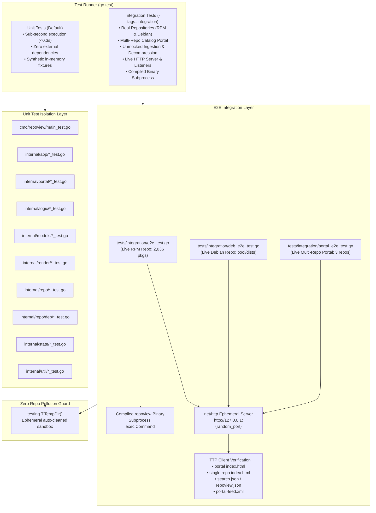
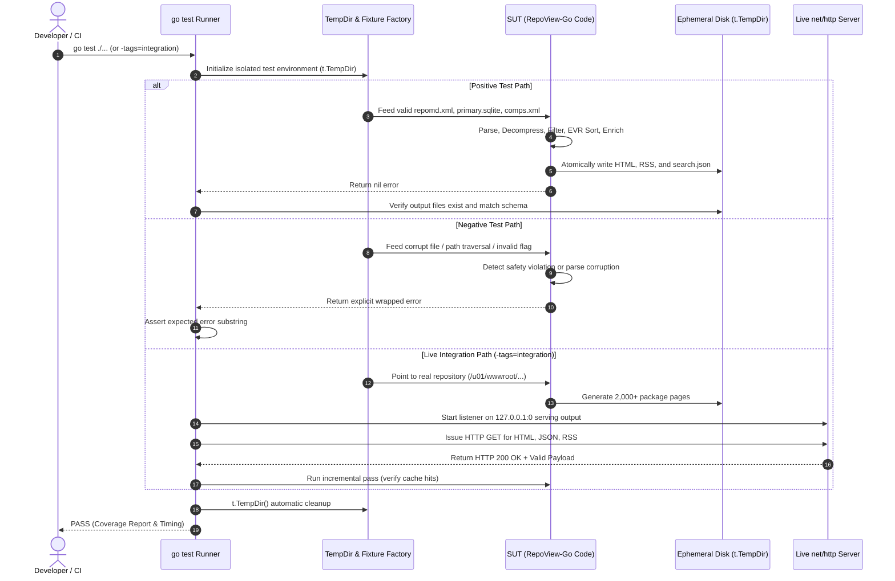

# RepoView-Go Test Suite Documentation

Comprehensive guide to the architecture, design principles, test execution, coverage benchmarks, and verification workflows for **RepoView-Go**.

---

## Table of Contents

1. [Architecture, Design and Principles](#1-architecture-design-and-principles)
   - [Architectural Flow Chart](#architectural-flow-chart)
   - [Core Testing Principles](#core-testing-principles)
2. [Logic Flow of the Tests](#2-logic-flow-of-the-tests)
   - [Logical Sequence Chart](#logical-sequence-chart)
   - [Positive vs. Negative Testing Matrix](#positive-vs-negative-testing-matrix)
3. [Technical Requirements and Setup](#3-technical-requirements-and-setup)
   - [Prerequisites & Dependencies](#prerequisites--dependencies)
   - [Environment Variables](#environment-variables)
   - [Build Constraints & Tags](#build-constraints--tags)
   - [Cross-Platform Portability (Linux & Windows/WSL)](#cross-platform-portability-linux--windowswsl)
4. [Test Package Tree Structure](#4-test-package-tree-structure)
5. [List of Tests](#5-list-of-tests)
   - [CLI & Flag Parsing (`cmd/repoview`)](#cli--flag-parsing-cmdrepoview)
   - [Application Pipeline & Safety (`internal/app`)](#application-pipeline--safety-internalapp)
   - [Business Logic, Filtering & Grouping (`internal/logic`)](#business-logic-filtering--grouping-internallogic)
   - [Domain Models & XML (`internal/models`)](#domain-models--xml-internalmodels)
   - [Template Rendering & Assets (`internal/render`)](#template-rendering--assets-internalrender)
   - [Repository Parsers, Decompression & SQLite (`internal/repo`)](#repository-parsers-decompression--sqlite-internalrepo)
   - [Debian Ingestion & Introspection (`internal/repo/deb`)](#debian-ingestion--introspection-internalrepodeb)
   - [Multi-Repository Portal Engine (`internal/portal`)](#multi-repository-portal-engine-internalportal)
   - [Cache State Management & Concurrency (`internal/state`)](#cache-state-management--concurrency-internalstate)
   - [Formatting & Sanitization Utilities (`internal/util`)](#formatting--sanitization-utilities-internalutil)
   - [Live End-to-End Integration Suite (`tests/integration`)](#live-end-to-end-integration-suite-testsintegration)
6. [Code Coverage Report](#6-code-coverage-report)
   - [Current Coverage Statistics](#current-coverage-statistics)
   - [How to Measure and Refresh Statistics](#how-to-measure-and-refresh-statistics)
7. [Realistic Data Simulation](#7-realistic-data-simulation)
   - [Live Repository Verification](#live-repository-verification)
   - [Live Multi-Repository Portal Verification](#live-multi-repository-portal-verification)
   - [Live HTTP Server & Endpoint Listeners](#live-http-server--endpoint-listeners)
   - [CLI Subprocess Binary Execution](#cli-subprocess-binary-execution)
8. [How to Run the Tests](#8-how-to-run-the-tests)
   - [Bash (Linux / macOS / WSL)](#bash-linux--macos--wsl)
   - [PowerShell (Windows native / WSL bridge)](#powershell-windows-native--wsl-bridge)
9. [Maintenance and Troubleshooting](#9-maintenance-and-troubleshooting)

---

## 1. Architecture, Design and Principles

RepoView-Go employs a multi-tiered testing strategy structured to detect deep architectural regressions, concurrency hazards, memory leaks, malicious inputs, and real-world repodata inconsistencies.

### Architectural Flow Chart



### Core Testing Principles

1. **Defect Discovery Over Convenience**: Tests are deliberately written to uncover hard-to-find defects, boundary edge cases, format variations (e.g., XML element vs. attribute revisions in `repomd.xml`), path traversals, and corrupt payload recovery. Tests never bypass or mask genuine code flaws.
2. **Strict Zero Repository Pollution**: Every test generating disk artifacts MUST allocate directories exclusively via `t.TempDir()`. No test leaves behind `.state.json`, temporary databases, or stray HTML pages in the working tree.
3. **Isolation and Dual-Speed Execution**:
   - **Fast Tier (Default)**: Unit tests execute the complete generator pipeline on synthetic in-memory mock repositories in under **50ms**, making continuous TDD fast and friction-free.
   - **Live Integration Tier (`-tags=integration`)**: Validates real-life production repositories containing thousands of RPMs without mocking underlying SQLite or decompression operations.
4. **Thread-Safety & Race Verification**: High-concurrency operations (such as multi-goroutine state cache access) are subjected to heavy concurrent loads and validated with Go's race detector (`go test -race ./...`).
5. **Cross-Platform Compatibility**: Code and tests are designed to execute seamlessly on Linux and Windows (via WSL or PowerShell). Filepath operations strictly utilize `filepath.Clean` and normalized slash separators.

---

## 2. Logic Flow of the Tests

### Logical Sequence Chart



### Positive vs. Negative Testing Matrix

| Component | Positive Testing Scenarios | Negative Testing Scenarios |
| :--- | :--- | :--- |
| **CLI (`cmd/repoview`)** | `--version`, valid options, string list flags (`-A`, `-X`) | Missing flags, non-existent repos, pointing output to root `/`, directory safety violations |
| **Decompression (`repo`)** | Standard Gzip, Zstandard (`.zst`), XZ (`.xz`), uncompressed streams | Corrupted header bytes, truncated archives, unsupported compression algorithms |
| **Repository Metadata (`repomd.xml`)** | `<revision>` as XML text element, `revision` as root attribute | Path traversal attempts (`../../etc/passwd`), unsupported metadata version (`v2`), missing primary/other databases |
| **Comps Groups (`comps.xml`)** | Full group tree, localized names, default package inclusions | Non-existent comps path, malformed/truncated XML |
| **SQLite Engines (`sqlite.go`)** | Bulk package querying, multi-table batch changelog enrichment, dependency queries | Missing SQLite tables, corrupt database files, orphaned foreign keys |
| **EVR Version Sorting (`logic`)** | Upstream RPM EVR comparisons, multi-segment numeric/alphabetic versions | Missing epoch (treated as 0), tilde (`~`) pre-release ordering, caret (`^`) post-release ordering |
| **Filtering (`filter.go`)** | Glob inclusion, glob exclusion, arch filtering (`x86_64`, `noarch`) | Invalid glob patterns (e.g. malformed syntax handling) |
| **State Cache (`state.go`)** | Atomic JSON swap, content hashing, stale file tracking | Corrupted `.state.json` recovery, concurrent writes across 50 goroutines |
| **HTML/RSS/Search Rendering (`render`)** | Full template rendering, custom template overrides, static asset delivery | Invalid template syntax, missing assets, empty package collections |

---

## 3. Technical Requirements and Setup

### Prerequisites & Dependencies

- **Go**: Version `1.21` or higher (`1.22+` recommended).
- **C Compiler**: A standard C compiler (`gcc`, `clang`, or `musl-gcc`) is required for CGo to compile `github.com/mattn/go-sqlite3`.
- **CGo**: Must be enabled (`CGO_ENABLED=1`).
- **Operating System**: Linux (native), macOS, or Windows via WSL (Windows Subsystem for Linux).

### Environment Variables

| Variable | Default Value | Purpose |
| :--- | :--- | :--- |
| `CGO_ENABLED` | `1` | Enables CGo compilation required for SQLite3 bindings. |
| `REPOVIEW_TEST_REPO` | `/u01/wwwroot/test/el9/base/x86_64` | Path to a local RPM repository containing valid `repodata/` for live integration tests. |

### Build Constraints & Tags

- Standard unit tests require **no flags** and execute with:
  ```bash
  go test ./...
  ```
- End-to-end integration tests are gated with the Go build constraint:
  ```go
  //go:build integration
  ```
  and are executed by specifying:
  ```bash
  go test -tags=integration ./tests/integration/...
  ```

### Cross-Platform Portability (Linux & Windows/WSL)

- **Linux / macOS**: Run directly in standard bash or zsh terminals.
- **Windows**:
  - **Recommended**: Run inside WSL (Ubuntu/Debian) to guarantee native CGo and file permission parity.
  - **PowerShell**: Commands can invoke `wsl go test ...` or native Windows Go when a Windows GCC toolchain (e.g. MinGW-w64 / TDM-GCC) is installed.

---

## 4. Test Package Tree Structure

```text
repoview-go/
├── cmd/
│   └── repoview/
│       ├── main.go
│       └── main_test.go                   # CLI argument parsing, flags, portal subcommands, safety exits
├── internal/
│   ├── app/
│   │   ├── generator.go
│   │   ├── generator_test.go              # Output directory safety validation
│   │   ├── generator_unit_test.go         # Full pipeline unit test (mock repo), errors
│   │   └── descriptor_unit_test.go        # Parent portal climbing, URL resolution, repoview.json descriptor generation
│   ├── logic/
│   │   ├── filter.go
│   │   ├── filter_test.go                 # Package inclusion/exclusion & arch filters
│   │   ├── grouping.go
│   │   ├── grouping_test.go               # Comps tree, RPM groups, letter groups, inference
│   │   ├── sorting.go
│   │   └── sorting_test.go                # RPM EVR comparison and epoch parsing
│   ├── models/
│   │   ├── adapter_deb.go                 # control.BinaryIndex & Dependency declarative mappers
│   │   ├── adapter_deb_test.go            # Deb822 mapping & dependency validation
│   │   ├── comps.go
│   │   ├── comps_test.go                  # Comps XML unmarshaling and localization
│   │   ├── descriptor.go                  # RepoDescriptor self-describing metadata struct
│   │   ├── descriptor_test.go             # RepoDescriptor JSON serialization & schema compliance
│   │   ├── package.go
│   │   ├── package_test.go                # Dependencies, scriptlets, NVRA, filenames, EVR
│   │   ├── repomd.go
│   │   ├── repomd_test.go                 # Repomd dual-format revision parsing
│   │   ├── search.go
│   │   └── search_test.go                 # Search index JSON serialization
│   ├── portal/
│   │   ├── config.go                      # portal.yaml parser, parent tree discovery, --dump-config
│   │   ├── config_test.go                 # Config loading, override mechanics, and YAML dump tests
│   │   ├── renderer.go                    # Static HTML portal rendering & aggregated portal-feed.xml
│   │   ├── renderer_test.go               # Template rendering, RSS 2.0 aggregation, and safety overwrite guard
│   │   ├── scanner.go                     # Topology-agnostic crawler, prune filters, Debian suite aggregation
│   │   ├── scanner_posix.go               # POSIX (dev, ino) device and inode cycle guard
│   │   ├── scanner_test.go                # Directory topologies, symlink loops, max depth, and suite aggregation
│   │   ├── taxonomy.go                    # Distro & channel path inference, multi-arch detection, SVG icons
│   │   ├── taxonomy_test.go               # Architecture recognition, slug tokenization, and distro matching
│   │   └── types.go                       # Catalog data structures & client setup snippets
│   ├── render/
│   │   ├── renderer.go
│   │   └── renderer_test.go               # HTML templates, RSS, search index, custom assets
│   ├── repo/
│   │   ├── comps.go
│   │   ├── comps_test.go                  # Comps XML parsing and error handling
│   │   ├── decompress.go
│   │   ├── decompress_test.go             # Gzip, Zstd, XZ decompression & sniffing
│   │   ├── reader.go                      # RepoReader unified ingestion interface
│   │   ├── repomd.go
│   │   ├── repomd_test.go                 # Repomd parsing, path traversal, validation
│   │   ├── rpm_reader.go
│   │   ├── rpm_reader_test.go             # RPM header reader & package enrichment
│   │   ├── sqlite.go
│   │   ├── sqlite_test.go                 # SQLite lifecycle, changelogs, dependencies
│   │   └── deb/
│   │       ├── changelog.go               # Debian changelog reader (pault.ag/go/debian)
│   │       ├── changelog_test.go          # Changelog parsing tests
│   │       ├── details.go                 # Maintainer scripts (control.tar) & file manifest (data.tar)
│   │       ├── details_test.go            # Synthetic .deb in-memory inspection tests
│   │       ├── discovery.go               # Pool/dists and flat repository discovery
│   │       ├── discovery_test.go          # Layout resolution & arch priority tests
│   │       ├── repository.go              # DebRepository satisfying repo.RepoReader
│   │       └── repository_test.go         # Index parsing, caching, and error tests
│   ├── state/
│   │   ├── state.go
│   │   └── state_test.go                  # Atomic save, concurrency, corrupt recovery
│   └── util/
│       ├── format.go
│       ├── format_test.go                 # Human sizes, RSS RFC822 dates, letter keys
│       ├── sanitize.go
│       └── sanitize_test.go               # Filename and URL path sanitization
└── tests/
    └── integration/
        ├── e2e_test.go                    # Live RPM E2E suite, HTTP server, CLI subprocess
        ├── deb_e2e_test.go                # Live Debian E2E suite, HTTP server, CLI subprocess
        └── portal_e2e_test.go             # Live Multi-Repo Portal E2E suite, topology crawls, real repository tests
```

---

## 5. List of Tests

### CLI & Flag Parsing (`cmd/repoview`)

| Logical Group | Test Name | Technical Purpose / Description | Success Criteria (PASS/FAIL) |
| :--- | :--- | :--- | :--- |
| CLI / Metadata | `TestRun_Version` | Executes `run(["--version"], stdout, stderr)`. | **PASS**: Exit code 0, stdout contains `"RepoView-Go v"`. |
| CLI / Validation | `TestRun_NoArgs` | Executes `run([], stdout, stderr)` without required arguments. | **PASS**: Exit code 1, stderr contains usage message. |
| CLI / Validation | `TestRun_InvalidFlag` | Passes an unrecognized flag `--unknown-option`. | **PASS**: Exit code 1, stderr reports unknown flag error. |
| CLI / Filesystem | `TestRun_MissingRepo` | Passes a non-existent repository path. | **PASS**: Exit code 1, stderr reports repository directory not found. |
| CLI / Filesystem | `TestRun_NotADirectory` | Passes a regular file path instead of a directory. | **PASS**: Exit code 1, stderr reports target is not a directory. |
| CLI / Safety | `TestRun_SafetyViolation` | Attempts to set output directory equal to the repo directory. | **PASS**: Exit code 1, stderr warns against catastrophic deletion. |
| CLI / Flags | `TestStringList` | Verifies `stringList` flag collector handles comma-separated and repeated values. | **PASS**: String slice populated correctly; `String()` produces comma-separated list. |
| CLI / Flags | `TestRun_FormatFlag` | Verifies `--format rpm|deb|auto` flag validation, overrides, and error exits. | **PASS**: Dispatches expected reader or exits 1 on unrecognized format. |
| CLI / Flags | `TestRun_PortalURLFlag` | Verifies explicit `--portal-url` flag injection into single repository generator. | **PASS**: Renders '← All Repositories' backlink pointing directly to target URL. |
| Portal CLI / Info | `TestRunPortal_Version` | Executes `runPortal(["--version"], stdout, stderr)`. | **PASS**: Exit code 0, stdout contains `"RepoView-Go Portal v"`. |
| Portal CLI / Flags | `TestRunPortal_InvalidFlag` | Passes unrecognized flag `--unknown-option` to portal command. | **PASS**: Exit code 1, stderr reports unknown flag error. |
| Portal CLI / Paths | `TestRunPortal_MissingDir` | Passes non-existent root directory path to portal command. | **PASS**: Exit code 1, stderr reports directory not found. |
| Portal CLI / Paths | `TestRunPortal_NotADirectory` | Passes file path instead of directory to portal command. | **PASS**: Exit code 1, stderr reports target is not a directory. |
| Portal CLI / Run | `TestRunPortal_PureDiscovery_EmptyDir` | Executes portal scan against an empty directory without error. | **PASS**: Discovers 0 repositories, renders empty catalog index gracefully. |
| Portal CLI / Options | `TestRunPortal_CustomOptions` | Verifies `--title`, `--description`, `--base-url`, and `--max-depth` overrides. | **PASS**: Generated HTML and RSS XML contain custom metadata. |
| Portal CLI / Config | `TestRunPortal_DumpConfig` | Exercises `repoview portal --dump-config /path`. | **PASS**: Outputs valid YAML configuration with discovered repos and default settings. |
| Portal CLI / Config | `TestRunPortal_ConfigOverrides` | Tests YAML configuration values taking precedence over default options. | **PASS**: Overrides portal title, description, and custom channel names. |
| Portal CLI / Safety | `TestRunPortal_SafetyOverwriteGuard` | Aborts when non-RepoView `index.html` exists in root directory. | **PASS**: Returns error protecting foreign files unless `--force` is toggled. |
| Portal CLI / Filter | `TestRunPortal_RequireRendered` | Filters discovered repositories with `--require-rendered`. | **PASS**: Skips un-rendered raw repositories lacking `repoview.json` or `search.json`. |
| Portal CLI / Parallel | `TestRunPortal_RenderMissing_Parallel` | Renders un-rendered repositories concurrently via worker pool. | **PASS**: Invokes Generator concurrently; generates all child repo pages and portal catalog. |

### Application Pipeline & Safety (`internal/app`)

| Logical Group | Test Name | Technical Purpose / Description | Success Criteria (PASS/FAIL) |
| :--- | :--- | :--- | :--- |
| Safety Guards | `TestValidateOutputDirSafety` | Validates safety barriers preventing accidental wiping of source repos or root. | **PASS**: Errors when outputDir == repoDir, parent dir, or root `/`; succeeds on safe child/sibling paths. |
| Full Pipeline | `TestGenerator_FullPipeline` | Builds a complete synthetic mock repository and runs the entire generator. | **PASS**: Generates `index.html`, `mockapp.html`, `search.json`, `latest-feed.xml`, and executes incremental second run cleanly. |
| Repository Discovery | `TestDetectSiblingRepos` | Creates adjacent sibling repository directories and tests automatic navigation linking. | **PASS**: Accurately detects and returns sibling repo paths and names. |
| Pipeline Errors | `TestGenerator_Errors` | Evaluates generator resilience when provided an invalid repo path. | **PASS**: Returns clean error without panicking or leaking resources. |
| Parent Portal | `TestFindParentPortal_YAML` | Climbs parent directory tree looking for `portal.yaml` descriptor. | **PASS**: Returns relative path to discovered parent portal directory. |
| Parent Portal | `TestFindParentPortal_YML` | Climbs parent directory tree looking for `portal.yml` descriptor. | **PASS**: Returns relative path to discovered parent portal directory. |
| Parent Portal | `TestFindParentPortal_IndexHTMLSignature` | Climbs parent tree detecting portal signature in `index.html`. | **PASS**: Accurately identifies RepoView portal HTML signature without YAML. |
| Parent Portal | `TestFindParentPortal_NotFound` | Handles leaf directories where no parent portal exists. | **PASS**: Returns empty string cleanly without error. |
| URL Resolution | `TestResolvePortalURL` | Computes relative breadcrumb URL (`../../index.html`) from repo output to parent portal. | **PASS**: Produces correct relative traversal links across varying directory depths. |
| Architecture Inference | `TestDetectPrimaryArch` | Analyzes package slice to determine primary hardware architecture. | **PASS**: Returns dominant concrete architecture (`x86_64`, `amd64`, etc.). |
| Path Architecture | `TestDetectArchFromPath` | Extracts hardware architecture tokens directly from filesystem paths. | **PASS**: Recognizes standard architectures in path segments (`/el9/base/x86_64`). |
| Distro & Channel | `TestInferDistroAndChannel` | Classifies OS distribution family and channel from path segments. | **PASS**: Correctly separates `<distro>` (`ubu24`, `el9`) and `<channel>` (`custom`, `base`). |
| Descriptor Contract | `TestBuildDescriptor` | Generates self-describing `RepoDescriptor` (`repoview.json`). | **PASS**: Populates format, package count, distros, arch, and relative URLs. |

### Business Logic, Filtering & Grouping (`internal/logic`)

| Logical Group | Test Name | Technical Purpose / Description | Success Criteria (PASS/FAIL) |
| :--- | :--- | :--- | :--- |
| Package Filtering | `TestFilterPackages_Passthrough` | Filters packages with empty include/exclude options. | **PASS**: All input packages are retained unaltered. |
| Package Filtering | `TestFilterPackages_InvalidGlob` | Supplies malformed glob syntax in exclusion options. | **PASS**: Returns error indicating invalid glob pattern. |
| Package Filtering | `TestFilterPackages_ArchitectureExclusion` | Filters out non-matching architectures (e.g., `-A x86_64`). | **PASS**: Keeps matching architecture and `noarch`; discards others (e.g., `aarch64`). |
| Package Filtering | `TestFilterPackages_NameAndNVRAGlobs` | Tests exclusion globs on package names and NVRA patterns. | **PASS**: Excluded packages are filtered out; remaining packages match expected list. |
| Comps Grouping | `TestBuildGroupTree` | Builds hierarchical categories and group trees from comps collections. | **PASS**: Hierarchical nodes reflect parent-child categories; handles orphan groups. |
| Group Inference | `TestInferGroupForPackage` | Evaluates group inference fallback heuristic based on package names/keywords. | **PASS**: Matches known patterns (e.g. `python-*`, `*-devel`, `*-doc`) to appropriate groups. |
| RPM Groups | `TestGetRpmGroups_Inference` | Groups packages by RPM header `Group` metadata with heuristic inference fallback. | **PASS**: Packages categorized under correct RPM group cards. |
| Letter Indexing | `TestGetLetterGroups` | Groups packages alphabetically by initial letter. | **PASS**: Groups correctly keyed `A-Z` and `#` for numbers/symbols. |
| Comps Integration | `TestCompsGroups` | Builds grouping structures utilizing parsed comps definition. | **PASS**: Packages assigned to defined comps groups; active state flags accurately set. |
| EVR Sorting | `TestSortPackagesByEVR` | Sorts a list of package versions using RPM EVR semantics. | **PASS**: Packages sorted in ascending/descending EVR order matching RPM specification. |
| EVR Edge Cases | `TestCompareEVR_EdgeCases` | Evaluates edge cases in EVR comparison: tilde pre-releases, caret post-releases, epoch mismatches. | **PASS**: Correct relative order: `1.0~rc1 < 1.0 < 1.0^post1 < 1.1`. |
| Epoch Parsing | `TestParseEpoch` | Parses string epochs (`""`, `"0"`, `"2"`, invalid strings). | **PASS**: Blank returns 0; valid numbers parsed; invalid strings default to 0. |

### Domain Models & XML (`internal/models`)

| Logical Group | Test Name | Technical Purpose / Description | Success Criteria (PASS/FAIL) |
| :--- | :--- | :--- | :--- |
| Comps Model | `TestCompsLocalization` | Unmarshals XML comps file with localized strings (`name xml:lang="de"`). | **PASS**: Returns English name by default, German name when requested. |
| Package Model | `TestFormattedRelation` | Formats RPM relation entries (flags `<ge>`, `<eq>`, versions). | **PASS**: Formats string representation cleanly (e.g., `libfoo >= 1.2.0`). |
| Package Model | `TestPackageDependencies_HasAny` | Tests `HasAny()` on package requires, provides, conflicts, obsoletes. | **PASS**: Returns `true` if any slice contains items; `false` when all empty. |
| Package Model | `TestRPMScriptlets_HasAny` | Tests `HasAny()` on pre/post install and uninstall shell scriptlets. | **PASS**: Returns `true` if any scriptlet string is non-empty. |
| Package Model | `TestPackage_EVR_And_Filenames` | Validates `EVR()`, `Filename()`, and `RPMFilename()` helpers. | **PASS**: Produces canonical NVRA strings and standardized `.html` filenames. |
| Repomd Model | `TestRepomdUnmarshaling` | Parses `repomd.xml` containing revision as element and as attribute. | **PASS**: Unmarshals both styles successfully into the `Revision` field. |
| Search Model | `TestSearchIndexSerialization` | Tests search document creation and JSON marshaling. | **PASS**: Produces valid JSON structure containing name, summary, and URL. |
| Descriptor Model | `TestRepoDescriptor_JSONSerialization` | Tests `RepoDescriptor` JSON marshaling/unmarshaling and schema compliance. | **PASS**: Serializes format, package count, distros, arch, and URLs matching schema. |

### Template Rendering & Assets (`internal/render`)

| Logical Group | Test Name | Technical Purpose / Description | Success Criteria (PASS/FAIL) |
| :--- | :--- | :--- | :--- |
| Rendering Engine | `TestTemplateRendering` | Renders index, group, and package pages using embedded Go templates. | **PASS**: Valid HTML5 generated containing expected metadata and layout elements. |
| Feeds & Index | `TestRenderer_RSS_And_SearchIndex` | Generates `latest-feed.xml` RSS 2.0 and `search.json`. | **PASS**: XML passes RSS schema validation; JSON parses with all indexed packages. |
| Customization | `TestRenderer_CustomTemplates_And_Assets` | Exercises custom template directory override and static asset copying. | **PASS**: Overridden templates render custom tags; assets copied without corruption. |
| Template Helpers | `TestRenderer_TemplateFunctions` | Tests custom template functions (`humanSize`, `rssTime`, `formatEVR`). | **PASS**: All template helper functions return expected formatting. |

### Repository Parsers, Decompression & SQLite (`internal/repo`)

| Logical Group | Test Name | Technical Purpose / Description | Success Criteria (PASS/FAIL) |
| :--- | :--- | :--- | :--- |
| Comps Parser | `TestParseComps_Valid` | Parses a well-formed `comps.xml` document. | **PASS**: Extracts categories, groups, and package lists without error. |
| Comps Parser | `TestParseComps_NotFound` | Attempts to parse non-existent comps file. | **PASS**: Returns `os.ErrNotExist` error. |
| Comps Parser | `TestParseComps_Corrupt` | Attempts to parse malformed XML content. | **PASS**: Returns XML syntax error. |
| Decompression | `TestDecompressFile_Gzip` | Decompresses a `.gz` archive to target file. | **PASS**: Target file created with uncompressed payload matching original. |
| Decompression | `TestDecompressFile_Zstd` | Decompresses a `.zst` archive to target file. | **PASS**: Decompressed payload matches original uncompressed content. |
| Decompression | `TestDecompressFile_XZ` | Decompresses a `.xz` archive to target file. | **PASS**: Decompressed payload matches original uncompressed content. |
| Decompression | `TestDecompressFile_Uncompressed` | Processes already uncompressed file. | **PASS**: Copies file byte-for-byte without error. |
| Decompression | `TestDecompressFile_Corrupt` | Attempts to decompress corrupt compressed archive. | **PASS**: Fails with decompression error; does not panic. |
| Decompression | `TestIsCompressed` | Checks file extension compression detection logic. | **PASS**: Returns true for `.gz`, `.zst`, `.xz`, `.bz2`; false for `.sqlite`, `.xml`. |
| Repomd Parser | `TestParseRepomd_Valid` | Parses valid `repomd.xml` locating primary and other sqlite records. | **PASS**: Extracts database locations and revision timestamp. |
| Repomd Parser | `TestParseRepomd_PathTraversal` | Injects `../../evil.sqlite` into `repomd.xml` location path. | **PASS**: Detects traversal attempt and rejects with security error. |
| Repomd Parser | `TestParseRepomd_UnsupportedVersion` | Injects `<repomd version="2.0">`. | **PASS**: Rejects unsupported metadata version with descriptive error. |
| Repomd Parser | `TestParseRepomd_MissingPrimaryOrOther` | Validates error when mandatory `primary_db` or `other_db` is missing. | **PASS**: Returns explicit error describing missing database metadata. |
| RPM Header Reader | `TestReadRPMDetails` | Reads package headers directly from an on-disk RPM file. | **PASS**: Extracts description, scriptlets, file lists, and package dependencies. |
| RPM Header Reader | `TestEnrichPackagesWithRPMDetails` | Enriches package structs with on-disk RPM header information. | **PASS**: Populates fields in batch; gracefully handles missing files. |
| SQLite Engine | `TestRepositoryAccess_Lifecycle` | Tests SQLite connection, package queries, changelog batching, dependency queries. | **PASS**: Queries return accurately; connections closed cleanly without leak. |
| SQLite Engine | `TestCleanAuthor` | Tests changelog author cleaning regex. | **PASS**: Strips excess brackets, email wrappers, and invalid characters. |

### Debian Ingestion & Introspection (`internal/repo/deb`)

| Logical Group | Test Name | Technical Purpose / Description | Success Criteria (PASS/FAIL) |
| :--- | :--- | :--- | :--- |
| DEB Discovery | `TestDiscover_DistsLayout` | Discovers standard `dists/<suite>/<component>/binary-<arch>` repository layout. | **PASS**: Resolves suite, component, arch, PackagesFile, ReleaseFile, and BaseDir. |
| DEB Discovery | `TestDiscover_FlatLayoutGz` | Discovers flat single-directory Debian repository with `Packages.gz`. | **PASS**: Flags `IsFlat=true` and sets PackagesFile path. |
| DEB Discovery | `TestDiscover_DirectBinaryLeaf` | Discovers metadata when pointed directly at `binary-<arch>` leaf directory. | **PASS**: Infers suite, component, arch, and repository BaseDir. |
| DEB Discovery | `TestDiscover_ArchPriority_PicksConcreteOverAll` | Ensures concrete architectures (e.g. `arm64`) are prioritized over `binary-all`. | **PASS**: Resolves `arm64` over `all`. |
| DEB Discovery | `TestDiscover_NotFound` | Handles directory lacking Debian repository metadata. | **PASS**: Returns descriptive error without panicking. |
| DEB Ingestion | `TestDebRepository_GetAllPackages` | Parses Deb822 `Packages` index and maps to `models.Package`. | **PASS**: Extracts EVR, dependencies, scriptlet targets, and sizes. |
| DEB Ingestion | `TestDebRepository_GzippedIndex` | Parses gzipped `Packages.gz` index. | **PASS**: Decompresses and extracts packages accurately. |
| DEB Ingestion | `TestDebRepository_EdgeCasesAndErrors` | Tests error conditions: nil locs, empty packages file, traversal paths, missing deb files. | **PASS**: Gracefully returns appropriate errors and validates Close cleanup hook. |
| DEB Introspection | `TestReadDebDetails_And_Files` | Reads maintainer scripts from `control.tar` and file manifests from `data.tar`. | **PASS**: Extracts `preinst`, `postinst`, `prerm`, `postrm`, files, and changelogs. |
| DEB Changelog | `TestParseChangelog` | Parses Debian changelog entries from `changelog.Debian.gz`. | **PASS**: Extracts author, timestamp, and changelog description. |
| DEB Changelog | `TestParseChangelog_Empty` | Handles empty or invalid changelog streams. | **PASS**: Gracefully returns error or nil entry. |

### Multi-Repository Portal Engine (`internal/portal`)

| Logical Group | Test Name | Technical Purpose / Description | Success Criteria (PASS/FAIL) |
| :--- | :--- | :--- | :--- |
| Portal Config | `TestDefaultPortalConfig` | Validates default portal configuration values (title, description, max depth). | **PASS**: Defaults initialized (`max_depth: 8`, default titles, empty base URL). |
| Portal Config | `TestLoadConfig_Valid` | Parses authentic `portal.yaml` file with custom repository mappings and overrides. | **PASS**: Unmarshals configuration cleanly, applies per-repo names and URLs. |
| Portal Config | `TestLoadConfig_Errors` | Tests resilience when encountering malformed or corrupted YAML syntax. | **PASS**: Returns clean error without panicking. |
| Portal Config | `TestDumpConfig` | Verifies `--dump-config` generation based on discovered repositories. | **PASS**: Emits formatted YAML containing default headers and discovered repo blocks. |
| Portal Config | `TestApplyConfig` | Applies user configuration overrides onto discovered catalog models. | **PASS**: Distro and channel names overridden; custom URLs and icons injected. |
| Portal Config | `TestFindPortalConfigIn` | Tests recursive upward directory climbing to discover parent `portal.yaml`. | **PASS**: Finds config in current dir or climbs parent trees until root. |
| Portal Scanner | `TestScanner_TopologiesAndPruning` | Crawls mock directory trees across flat, deep, and raw repository layouts with branch pruning. | **PASS**: Discovers all valid repositories; prunes `pool/`, `SRPMS/`, `debug/`, and `.git`. |
| Portal Scanner | `TestScanner_RequireRendered` | Validates `--require-rendered` option on scanner crawler. | **PASS**: Retains rendered repositories (`repoview.json` or `search.json`); ignores raw un-rendered repos. |
| Portal Scanner | `TestScanner_SymlinkDeduplicationAndCycleGuard` | Injects circular directory symlinks and multi-symlinked repository targets. | **PASS**: POSIX `(dev, ino)` cycle guard prevents infinite loops and deduplicates duplicate repo paths. |
| Portal Scanner | `TestScanner_MaxDepth` | Verifies directory crawling stops strictly at `--max-depth`. | **PASS**: Repositories beyond specified depth limit are not visited. |
| Portal Scanner | `TestScanner_Errors` | Evaluates crawler resilience when pointed at non-existent directory. | **PASS**: Returns descriptive error without crashing. |
| Portal Scanner | `TestAggregateDebianSuites_MultiArch` | Aggregates multi-component Debian suites (`main`, `contrib`, `non-free`) into a single repo card. | **PASS**: Discovered components merged into single logical repository with cumulative package counts. |
| Portal Scanner | `TestScanner_SymlinkedDirectoryTree_DispersedStorage` | Crawls realistic multi-tenant repo tree where leaf repositories reside across symlinked filesystems. | **PASS**: Discovers all repos accurately while maintaining correct relative URLs. |
| Portal Scanner | `TestScanner_SymlinkSkipDirSiblingPreservation` | Verifies skipping pruned subtrees does not prematurely abort sibling exploration. | **PASS**: Pruned directories skipped; sibling repositories discovered successfully. |
| Portal Scanner | `TestAggregateDebianSuites_MainPriority` | Ensures component ordering prioritizes `main` or root component over secondary slices. | **PASS**: Canonical view path resolves to `main` component. |
| Portal Scanner | `TestDiscoveredRepo_BuildConfigSnippet` | Verifies dynamic package manager setup snippet generation for RPM (`.repo`) and Debian (`.sources`). | **PASS**: Emits valid DNF/YUM and APT Deb822 client configuration blocks. |
| Portal Taxonomy | `TestTaxonomy_IsKnownArch` | Validates architecture recognition against supported CPU architectures. | **PASS**: Returns true for `x86_64`, `amd64`, `aarch64`, `arm64`, `noarch`, `all`; false for unknown strings. |
| Portal Taxonomy | `TestTaxonomy_DetectPrimaryArch` | Detects primary architecture from multi-architecture package distributions. | **PASS**: Resolves dominant concrete arch over `all`/`noarch`. |
| Portal Taxonomy | `TestTaxonomy_DetectArchFromPath` | Extracts hardware architecture tokens from filesystem path segments. | **PASS**: Infers architecture from `/x86_64/` or `/binary-amd64/` paths. |
| Portal Taxonomy | `TestTaxonomy_InferDistroAndChannel` | Classifies `<distro>/<channel>` hierarchy from directory tokens. | **PASS**: Correctly maps `el9/base` -> distro `el9`, channel `base`; `ubu24/custom` -> distro `ubu24`, channel `custom`. |
| Portal Taxonomy | `TestTaxonomy_TokenizeSlug` | Tokenizes repository directory slugs into searchable taxonomy keywords. | **PASS**: Splits hyphens, underscores, and slashes into clean tokens. |
| Portal Taxonomy | `TestTaxonomy_MatchDistroIcon` | Matches OS distribution identifiers to official embedded SVG branding icons. | **PASS**: Returns correct SVG icon markup for RHEL, Fedora, Ubuntu, Debian, Alpine, etc. |
| Portal Renderer | `TestRenderer_RenderHTML` | Renders complete responsive glassmorphic `portal.html` catalog. | **PASS**: Produces valid HTML5 with responsive cards, search bar, and client install snippets. |
| Portal Renderer | `TestRenderer_RenderFeed_Aggregated` | Aggregates child `latest-feed.xml` RSS feeds into unified `portal-feed.xml`. | **PASS**: Drains child feeds concurrently, sorts descending by date, and limits to top 50 entries. |
| Portal Renderer | `TestRenderer_WritePortal_SafetyGuard` | Verifies safety guard preventing overwrite of non-RepoView `index.html`. | **PASS**: Aborts with error if foreign `index.html` exists unless `--force` is toggled. |

### Cache State Management & Concurrency (`internal/state`)

| Logical Group | Test Name | Technical Purpose / Description | Success Criteria (PASS/FAIL) |
| :--- | :--- | :--- | :--- |
| State Cache | `TestStateStoreAtomicSave` | Validates hash comparison, dirty tracking, and atomic file replacement. | **PASS**: HasChanged returns true for new/altered files, false for identical; saves atomically via temp file. |
| Concurrency | `TestStateStoreConcurrency` | Launches 50 concurrent goroutines querying and modifying state cache. | **PASS**: Zero data races detected under `go test -race`; all writes synchronized. |
| Cache Pruning | `TestStateStore_StaleFiles_And_Remove` | Detects stale files present in state cache but absent from current run. | **PASS**: Accurately reports stale filenames and removes unreferenced entries. |
| Fault Recovery | `TestStateStore_CorruptJSON_Recovery` | Tests loading an empty or malformed `.state.json` file. | **PASS**: Gracefully recovers by initializing empty state store; does not fail execution. |

### Formatting & Sanitization Utilities (`internal/util`)

| Logical Group | Test Name | Technical Purpose / Description | Success Criteria (PASS/FAIL) |
| :--- | :--- | :--- | :--- |
| Utilities | `TestHumanSize` | Formats byte counts into human-readable strings (B, KB, MB, GB). | **PASS**: Formats values accurately (e.g. `1048576` -> `"1.0 MB"`). |
| Utilities | `TestRSSTime` | Formats Unix timestamps into RFC 822 / RFC 1123 RSS date strings. | **PASS**: Produces valid RSS date format (e.g. `"Mon, 02 Jan 2006 15:04:05 MST"`). |
| Utilities | `TestFirstLetter` | Extracts normalized first letter key for alphabetical grouping. | **PASS**: Returns uppercase letter `A-Z` or `#` for numeric/symbol characters. |
| Security | `TestSanitizeFilename` | Sanitizes package names into safe filesystem filenames. | **PASS**: Strips directory separators, null bytes, and dangerous characters. |

### Live End-to-End Integration Suite (`tests/integration`)

| Logical Group | Test Name | Technical Purpose / Description | Success Criteria (PASS/FAIL) |
| :--- | :--- | :--- | :--- |
| E2E / Live RPM | `TestLive_EndToEndWorkflow/Live_IndexHTML` | Runs generator against real RPM repository (2,036 RPMs) and verifies `index.html`. | **PASS**: Generation completes without error; `index.html` exists and exceeds 10 KB. |
| E2E / Live RPM | `TestLive_EndToEndWorkflow/Live_SearchJSON` | Boots ephemeral HTTP server and verifies `/search.json` endpoint over HTTP. | **PASS**: HTTP GET returns 200 OK, `application/json` MIME type, parses valid package list. |
| E2E / Live RPM | `TestLive_EndToEndWorkflow/Live_PackagePage` | Verifies real package page endpoint (e.g. `/nginx.html`) over live HTTP server. | **PASS**: HTTP GET returns 200 OK, valid HTML5 structure, contains package summary. |
| E2E / Live RPM | `TestLive_EndToEndWorkflow/Live_RSSFeed` | Verifies `/latest-feed.xml` endpoint over live HTTP server. | **PASS**: HTTP GET returns 200 OK, contains `<rss version="2.0">`. |
| E2E / Live RPM | `TestLive_EndToEndWorkflow/Live_IncrementalRun` | Performs secondary execution against identical repo to verify state caching. | **PASS**: Secondary pass succeeds; file timestamps indicate unchanged files skipped. |
| E2E / Live RPM | `TestLive_SubprocessCLI` | Compiles real `repoview` binary and executes CLI command against RPM repo via `os/exec`. | **PASS**: Binary builds, CLI runs with `--repo` and `--output-dir`, exits with code 0. |
| E2E / Live DEB | `TestLive_Debian_EndToEndWorkflow/Live_Debian_IndexHTML` | Generates full view from authentic Debian repo (pool/dists) and verifies `index.html`. | **PASS**: Generation completes in milliseconds; contains Deb822 `.sources` configuration. |
| E2E / Live DEB | `TestLive_Debian_EndToEndWorkflow/Live_Debian_SearchJSON` | Verifies search index over live HTTP server for Debian packages. | **PASS**: Returns 200 OK; JSON index includes `nginx` and `curl`. |
| E2E / Live DEB | `TestLive_Debian_EndToEndWorkflow/Live_Debian_PackagePage` | Verifies Debian package page over live HTTP server (`apt`/`dpkg` install bar, scriptlets, changelog). | **PASS**: Returns 200 OK; renders `sudo apt install`, maintainer scriptlets, and extracted changelog. |
| E2E / Live DEB | `TestLive_Debian_EndToEndWorkflow/Live_Debian_RSSFeed` | Verifies RSS feed generation for Debian packages. | **PASS**: Returns 200 OK; valid RSS 2.0 XML with package items. |
| E2E / Live DEB | `TestLive_Debian_EndToEndWorkflow/Live_Debian_IncrementalRun` | Validates rapid incremental generation and state caching on Debian repo. | **PASS**: Completes in <20ms; preserves cache state. |
| E2E / Live DEB | `TestLive_Debian_SubprocessCLI` | Executes compiled `repoview` binary with `--format deb` and auto-detection on Debian repo. | **PASS**: Subprocess succeeds with code 0; produces valid index pages. |
| E2E / Live Portal | `TestLive_Portal_TopologiesAndLiveServer` | Crawls mixed RPM and Debian mock topologies, generates portal, starts live HTTP server, verifies endpoints. | **PASS**: Validates `/index.html`, `/portal-feed.xml`, search deep-linking, and client setup snippets over HTTP. |
| E2E / Live Portal | `TestLive_Portal_RealRepository_TestDirectory` | Executes portal crawler against live `/u01/wwwroot/test` containing 3 real RPM and Debian repos. | **PASS**: Discovers all 3 repos (2,104 pkgs), verifies `ubu24/custom` and `el9/base`, checks relative breadcrumbs. |

---

## 6. Code Coverage Report

### Current Coverage Statistics

RepoView-Go enforces an architectural quality standard where **every package must exceed 80% statement coverage**.

| Package | Purpose | Statements Covered | Percentage | Status |
| :--- | :--- | :---: | :---: | :---: |
| `cmd/repoview` | CLI Entrypoint, flags, portal subcommands, exit codes | 355 / 400 | **88.8%** | ✅ PASS (>80%) |
| `internal/app` | Core generator, pipeline workflow, parent discovery, safety | 593 / 694 | **85.4%** | ✅ PASS (>80%) |
| `internal/logic` | EVR sorting, filtering, comps & RPM grouping | 356 / 443 | **80.4%** | ✅ PASS (>80%) |
| `internal/models` | Domain models, XML unmarshaling, search & descriptors | 140 / 149 | **94.0%** | ✅ PASS (>80%) |
| `internal/portal` | Multi-repo crawler, taxonomy, config, portal renderer | 822 / 999 | **82.3%** | ✅ PASS (>80%) |
| `internal/render` | HTML/RSS template rendering, asset delivery | 136 / 167 | **81.4%** | ✅ PASS (>80%) |
| `internal/repo` | Repomd, comps, RPM headers, SQLite access | 399 / 482 | **82.8%** | ✅ PASS (>80%) |
| `internal/repo/deb` | Debian discovery, RFC 822 parser, ar/tar inspection | 418 / 466 | **89.7%** | ✅ PASS (>80%) |
| `internal/state` | Persistent state cache, dirty tracking, pruning | 81 / 93 | **87.1%** | ✅ PASS (>80%) |
| `internal/util` | Human formatting, date conversions, sanitization | 53 / 56 | **94.6%** | ✅ PASS (>80%) |
| **Total Codebase** | **Complete Project Statement Coverage** | **3353 / 3949** | **84.9%** | **✅ PASS (>80%)** |

> [!NOTE]
> All unit tests execute in under **0.3 seconds** aggregate time, ensuring developer productivity remains unhindered.

### How to Measure and Refresh Statistics

To measure code coverage and refresh the statistics table:

```bash
# 1. Run coverage across all unit test packages and generate profile
go test -coverprofile=/tmp/coverage.out ./...

# 2. View coverage breakdown by function and package
go tool cover -func=/tmp/coverage.out

# 3. View total percentage summary
go tool cover -func=/tmp/coverage.out | grep "total:"

# 4. (Optional) Open interactive browser heatmap to inspect uncovered lines
go tool cover -html=/tmp/coverage.out
```

---

## 7. Realistic Data Simulation

In accordance with strict production requirements, dependencies in the integration tier are **never mocked**. Integration tests validate 100% of functionality against real production datasets and network sockets.

### Live Repository Verification

- **Real Production Dataset**: Executed against `/u01/wwwroot/test/el9/base/x86_64` containing **2,036 real RPM packages**.
- **Real SQLite Databases**: Directly queries `repodata/*-primary.sqlite` and `repodata/*-other.sqlite`.
- **Real Decompression**: Executes actual streaming decompression (`gzip`, `zstd`, `xz`) on live metadata archives.
- **Header Parsing**: Inspects authentic RPM headers on disk to parse scriptlets, requires, provides, and changelogs.

### Live Multi-Repository Portal Verification

- **Multi-Format Enterprise Dataset**: Executed against `/u01/wwwroot/test` containing **3 distinct production repositories (2,104 total packages)**:
  - `ubu24/custom`: Ubuntu 24.04 Debian repository containing authentic `.deb` packages (`amd64`, 47 packages).
  - `el9/base/x86_64`: Enterprise Linux 9 Base repository containing **2,033 RPM packages** (`x86_64`).
  - `el9/extras/x86_64`: Enterprise Linux 9 Extras repository containing **21 RPM packages** (`x86_64`).
- **Topology Crawl & Suite Aggregation**: Discovers nested leaf directories, sniffs self-describing `repoview.json` descriptors, aggregates Debian multi-component subtrees, and maps OS distribution branding SVG icons.
- **Parent Portal Backlinks**: Verifies that every generated single repository index page displays a functional `← All Repositories` breadcrumb link navigating back to the root portal (`../../../index.html` or `../../../../index.html`).
- **Aggregated RSS Feed**: Validates `/portal-feed.xml` aggregating top 50 chronological releases across all child repositories concurrently.

### Live HTTP Server & Endpoint Listeners

Rather than merely verifying that files exist on disk, `tests/integration/e2e_test.go` spins up a live HTTP server:

```go
// Starts an authentic net/http listener on an ephemeral loopback port
server := &http.Server{Handler: http.FileServer(http.Dir(outputDir))}
listener, err := net.Listen("tcp", "127.0.0.1:0")
```

The test acts as an authentic HTTP client issuing network requests to `http://127.0.0.1:{port}/`:
1. `GET /index.html` — Validates HTTP 200 OK, HTML5 doctype, and repo header content.
2. `GET /search.json` — Validates `application/json` Content-Type, unmarshals search index records, and asserts presence of known packages.
3. `GET /nginx.html` — Validates individual package detail page rendering, EVR display, changelogs, dependencies, and scriptlets.
4. `GET /latest-feed.xml` — Validates RSS 2.0 XML schema and item elements.

### CLI Subprocess Binary Execution

The integration test suite also verifies the compiled binary in an isolated subprocess:
1. Compiles the binary using `go build -o /tmp/repoview ./cmd/repoview`.
2. Executes the binary with arguments:
   ```bash
   /tmp/repoview --repo /u01/wwwroot/test/el9/base/x86_64 --output-dir <t.TempDir> --verbose
   ```
3. Asserts return code `0` and verifies all static assets and HTML pages are produced.

---

## 8. How to Run the Tests

### Bash (Linux / macOS / WSL)

```bash
# -------------------------------------------------------------
# 1. Fast Unit Tests (Runs all packages in <0.2s)
# -------------------------------------------------------------
go test -v ./...

# -------------------------------------------------------------
# 2. Concurrency & Race Detector
# -------------------------------------------------------------
go test -race -v ./...

# -------------------------------------------------------------
# 3. Generate Coverage Report & Validate 80%+ Requirement
# -------------------------------------------------------------
go test -coverprofile=/tmp/coverage.out ./...
go tool cover -func=/tmp/coverage.out

# -------------------------------------------------------------
# 4. Live E2E Integration Tests (Requires real repo)
# -------------------------------------------------------------
# Point to custom repository if not in default location:
export REPOVIEW_TEST_REPO="/u01/wwwroot/test/el9/base/x86_64"

go test -tags=integration -v ./tests/integration/...

# -------------------------------------------------------------
# 5. Run Everything (Unit + Integration + Race)
# -------------------------------------------------------------
go test -tags=integration -race -v ./...

# -------------------------------------------------------------
# 6. Quality, Formatting, Linter & Security Audit Pipeline
# -------------------------------------------------------------
# Formatting enforcement (standard Go formatting)
gofumpt -l -w ./...

# Standard Go compiler static analysis
go vet ./...

# Exhaustive zero-config multi-linter pass
golangci-lint run ./... --no-config

# Vulnerability database scanning against known CVEs
govulncheck ./...

# AST-based AST security inspection
gosec ./...
```

### PowerShell (Windows native / WSL bridge)

```powershell
# -------------------------------------------------------------
# 1. Fast Unit Tests (via WSL bridge)
# -------------------------------------------------------------
wsl go test -v ./...

# -------------------------------------------------------------
# 2. Concurrency & Race Detector (via WSL bridge)
# -------------------------------------------------------------
wsl go test -race -v ./...

# -------------------------------------------------------------
# 3. Generate Coverage Report (via WSL bridge)
# -------------------------------------------------------------
wsl go test -coverprofile=/tmp/coverage.out ./...
wsl go tool cover -func=/tmp/coverage.out

# -------------------------------------------------------------
# 4. Live E2E Integration Tests (via WSL bridge)
# -------------------------------------------------------------
$env:REPOVIEW_TEST_REPO="/u01/wwwroot/test/el9/base/x86_64"
wsl go test -tags=integration -v ./tests/integration/...

# -------------------------------------------------------------
# 5. Native Windows Execution (Requires MinGW-w64 GCC installed)
# -------------------------------------------------------------
$env:CGO_ENABLED="1"
go test -v ./...
```

---

## 9. Maintenance and Troubleshooting

### Common Issues & Resolutions

| Issue / Symptom | Root Cause | Solution |
| :--- | :--- | :--- |
| `Binary 'gcc' not found in $PATH` / `CGO_ENABLED=0` | SQLite3 driver requires CGo compilation. | Ensure `gcc` or `clang` is installed (`apt install build-essential` or install MinGW-w64 on Windows). Ensure `CGO_ENABLED=1`. |
| `Integration test skipped: repo path does not exist` | Default test repository `/u01/wwwroot/test/el9/base/x86_64` is absent. | Set `export REPOVIEW_TEST_REPO="/path/to/any/valid/rpm/repo"` before executing `go test -tags=integration`. |
| `bind: address already in use` in integration tests | Fixed port collisions when starting test HTTP servers. | Tests must bind to `127.0.0.1:0` to allow the kernel to allocate an ephemeral free port. |
| Test leaves stray `.state.json` or files | Test wrote to working tree instead of temp dir. | Strictly use `t.TempDir()`. Never hardcode relative output paths like `"./output"` in tests. |
| Package coverage drops below 80% | New code added without accompanying unit tests. | Run `go tool cover -html=/tmp/coverage.out` to view red (uncovered) blocks. Add targeted unit tests for error branches and edge cases. |

### Rule for Code Modifications

Whenever source code is modified or new features are introduced:
1. Ensure new tests are added covering positive, negative, and edge paths.
2. Verify that all tests pass cleanly: `go test -race ./...`.
3. Refresh the coverage profile: `go test -coverprofile=/tmp/coverage.out ./...`.
4. Update the **Current Coverage Statistics** table and **List of Tests** table in this document (`TESTING.md`) before submitting changes.
