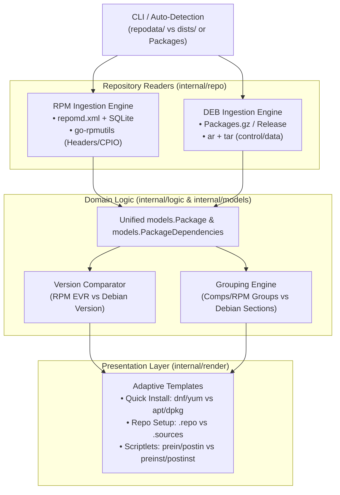
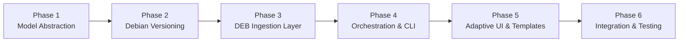

# Debian Packages Support by repoview-go

**It is architecturally a natural fit** for RepoView-Go to support Debian (`.deb`) repositories with the exact same visual layout, high-performance static site generation, and rich interactive features as RPM.

Debian/APT and RPM/YUM ecosystems share nearly identical metadata concepts, dependency paradigms, and lifecycle mechanics. In fact, because Debian repository metadata is text-stream oriented and `.deb` packages use standardized Unix archives (`ar` + `tar`), implementing DEB support in Go is in several ways cleaner and lighter than RPM's SQLite/CGo stack.

---

### 1. Conceptual Mapping: RPM vs. DEB

| Feature / Concept | RPM / YUM Ecosystem | DEB / APT Ecosystem | RepoView-Go UI Representation |
| :--- | :--- | :--- | :--- |
| **Repository Entrypoint** | `repodata/repomd.xml` | `dists/<suite>/Release` (or flat `Release` / `Packages`) | Sibling switcher, repo title, build timestamp |
| **Package Metadata Index** | `primary.sqlite` (or `primary.xml.gz`) | `Packages` (or `Packages.gz` / `.xz` / `.zst` in deb822 format) | Package list, summaries, descriptions, licenses, sizes |
| **Changelog Index** | `other.sqlite` (or `other.xml.gz`) | `changelog.Debian.gz` (in package) or external changelog index | Expandable changelog history per version |
| **Version & Release** | `Epoch:Version-Release.Arch` (EVR) | `[epoch:]upstream_version[-debian_revision]` | EVR badge, sorting newest-to-oldest |
| **Categorization / Groups** | `comps.xml` & Spec `Group` tag | Package `Section` (e.g., `net`, `devel`, `admin`, `web`, `libs`) | Hierarchical sidebar group tree & group pages |
| **Alphabetical Index** | First letter of package name | First letter of package name | Letter navigation matrix (`A`–`Z`) |
| **Dependencies** | Requires, Provides, Conflicts, Obsoletes | Depends, Pre-Depends, Recommends, Suggests, Provides, Conflicts, Breaks, Replaces | Interactive dependency vector tabs with live filtering |
| **Lifecycle Scriptlets** | `prein`, `postin`, `preun`, `postun` | `preinst`, `postinst`, `prerm`, `postrm` | Scriptlet code inspection blocks with syntax styling |
| **File Manifests** | RPM cpio header inspection | `data.tar.*` tar headers or `Contents-<arch>.gz` | File list table with permissions, owner, size, search |
| **Quick Install Bar** | `dnf install`, `yum install`, `wget`, `curl` | `apt install`, `apt-get install`, `dpkg -i`, `wget`, `curl` | One-click copy installation commands |
| **Client Config Snippet** | `/etc/yum.repos.d/<repo>.repo` | `/etc/apt/sources.list.d/<repo>.sources` (modern) or `.list` | Modal dialog with copyable configuration snippet |

---

### 2. Technical Ingestion & Extraction Architecture

#### A. Repository Index Ingestion (`Packages` / `Release`)
- **RPM**: Repoview decompresses `repodata/primary.sqlite` and `other.sqlite`, running batched SQL queries with SQLite CGo bindings.
- **DEB**: Debian repositories use RFC 822 / Deb822 stanza format (`Packages` file). Each package is an easily parseable text block:
  ```text
  Package: nginx
  Version: 1.22.1-9
  Architecture: amd64
  Maintainer: Debian Nginx Maintainers <pkg-nginx-maintainers@lists.alioth.debian.org>
  Installed-Size: 1354
  Depends: libc6 (>= 2.34), libpcre2-8-0 (>= 10.22), libssl3 (>= 3.0.0)
  Recommends: logrotate
  Suggests: nginx-doc
  Conflicts: nginx-core, nginx-light
  Section: httpd
  Priority: optional
  Filename: pool/main/n/nginx/nginx_1.22.1-9_amd64.deb
  Size: 524108
  SHA256: 7f8a...
  Description: small, powerful, scalable web/proxy server
   Nginx is a web server which also acts as a reverse proxy or IMAP/POP3 proxy...
  ```
  - **Zero Custom Parser Code**: Parsing Deb822 stanzas requires **no custom lexer or scanner**. `pault.ag/go/debian/control` provides `control.ParseBinaryIndex()`, which streams and unmarshals `Packages` directly into strongly-typed `control.BinaryIndex` structs in milliseconds. It requires **zero CGo**, has zero SQLite locking concerns, and transparently handles `.gz`, `.xz`, and `.zst`.

#### B. Deep Package Introspection (`.deb` Binary Inspection)
- A `.deb` package file is a standard Unix `ar` archive containing three members:
  1. `debian-binary` (`2.0\n`)
  2. `control.tar.<gz|xz|zst>`: Contains package control files (`control`, `preinst`, `postinst`, `prerm`, `postrm`, `md5sums`, `conffiles`).
  3. `data.tar.<gz|xz|zst>`: Contains the installed filesystem tree.
- **Zero Custom Archive Code**: `pault.ag/go/debian/deb` completely abstracts the `ar` container and `control.tar.*` / `data.tar.*` members with `deb.LoadFile(path)` and `deb.LoadAr()`:
  - **Scriptlets**: Extracted directly by streaming `deb.ArContent["control.tar.*"].Tarfile()` to read `preinst`, `postinst`, `prerm`, and `postrm` script bodies.
  - **File Manifests on Demand**: `deb.Data` is already an initialized standard `*tar.Reader`. Repoview scans file headers (`header.Name`, `header.Mode`, `header.Size`, `header.Uname`, `header.Gname`) **without** decompressing or allocating file payloads into memory.

#### C. Version Comparison & Sorting
- RPM uses `go-rpm-version` (`rpmvercmp`).
- Debian uses Debian version comparison semantics (`[epoch:]upstream[-debian_revision]`), where:
  - Tildes (`~`) sort before anything (used for alpha/beta/rc pre-releases).
  - Letters sort before digits except `~`.
- **Solution**: Debian version sorting is handled using `pault.ag/go/debian/version`, adhering 100% to Debian policy manual §5.6.12 and dpkg's native `verrevcmp` algorithm.

#### D. Categorization & Taxonomies
- RPM repositories often have empty spec groups, requiring the heuristic classification engine in `internal/logic/grouping.go`.
- Debian packages **mandatorily declare a `Section` field** (e.g. `admin`, `database`, `devel`, `editors`, `fonts`, `gnome`, `graphics`, `httpd`, `libs`, `mail`, `net`, `python`, `security`, `shells`, `utils`, `web`).
- Debian sections map directly into the hierarchical category tree (`internal/logic/grouping.go:BuildGroupTree`) without requiring external Comps XML files. Sub-sections (e.g. `python/libs`, `debug/net`) naturally populate the two-tier category sidebar.

#### E. Complete Metadata Delegation Matrix

Every required piece of Debian metadata maps directly to existing functions in `pault.ag/go/debian`, ensuring custom parsing code is minimized to near-zero:

| Target Metadata | `pault.ag/go/debian` Component | Custom Parsing Code |
| :--- | :--- | :--- |
| **`Packages` Index Stanzas** | `control.ParseBinaryIndex(reader)` $\rightarrow$ `[]control.BinaryIndex` | **0 lines** (direct struct unmarshaling) |
| **`Release` / `InRelease`** | `control.Unmarshal(&releaseStruct, reader)` | **0 lines** (deb822 control tag mapping) |
| **Dependencies & Relations** | `control.BinaryIndex.GetDepends()`, `.GetPreDepends()`, etc. $\rightarrow$ `dependency.Dependency` | **0 lines** (native grammar parsing) |
| **Version EVR & Sorting** | `version.Parse(str)` & `version.Compare(v1, v2)` | **0 lines** (native dpkg `verrevcmp` logic) |
| **`.deb` Archive Decoding** | `deb.LoadFile(path)` $\rightarrow$ `*deb.Deb` | **0 lines** (transparent `ar` decoding) |
| **Maintainer Scripts** | `deb.ArContent["control.tar.*"].Tarfile()` $\rightarrow$ read `preinst`, `postinst`, etc. | **0 lines** (archive/tar header iterator) |
| **Installed File Manifests** | `deb.Data` $\rightarrow$ `*tar.Reader` (stream file headers on demand) | **0 lines** (direct `tar.Header` reads) |
| **Package Changelogs** | `changelog.Parse(reader)` $\rightarrow$ `[]changelog.ChangelogEntry` | **0 lines** (standard Debian changelog parser) |

---

### 3. Architecture & Codebase Adaptations Needed

To support both packaging formats cleanly without breaking existing RPM capabilities:



#### 1. Abstraction in `internal/models/package.go`
The package model already has almost everything needed. A few fields would simply be normalized or generalized:
- `SourceRPM` $\rightarrow$ `SourcePackage` (e.g., `nginx_1.22.1-9.dsc` or upstream source).
- `RPMGroup` $\rightarrow$ `Section` / `Group`.
- `RPMDetails` $\rightarrow$ `PackageDetails` (holding unified `Scriptlets` and `Files`).
- `PackageDependencies`:
  - Map Debian `Depends` / `Pre-Depends` $\rightarrow$ `Requires` (with `Pre` flag).
  - Map Debian `Provides` $\rightarrow$ `Provides`.
  - Map Debian `Conflicts` / `Breaks` $\rightarrow$ `Conflicts`.
  - Map Debian `Replaces` $\rightarrow$ `Obsoletes`.
  - Expose Debian `Recommends` and `Suggests` as additional optional tabs in the UI.

#### 2. Auto-Detection in `cmd/repoview` & `internal/app`
RepoView can automatically inspect the input directory:
- Contains `repodata/repomd.xml` $\rightarrow$ **RPM Mode**
- Contains `dists/` or `Packages` / `Packages.gz` $\rightarrow$ **DEB Mode**
- Optional manual override flag: `--format=rpm|deb` (default: `auto`).

#### 3. Presentation Layer Adaptations (`internal/render/templates/`)
The UI template structure remains 100% identical, with dynamic switches based on the repository format:
- **Quick Install Bar**:
  - For RPM: `dnf`, `yum`, `wget`, `curl`
  - For DEB: `apt`, `dpkg`, `wget`, `curl` (e.g. `sudo apt install <pkg>` and `sudo dpkg -i <pkg>.deb`)
- **Repository Setup Modal**:
  - For RPM: Displays `/etc/yum.repos.d/<repo>.repo` file configuration.
  - For DEB: Displays modern deb822 format (`/etc/apt/sources.list.d/<repo>.sources`):
    ```text
    Types: deb
    URIs: http://your-repo-url/
    Suites: stable
    Components: main
    Signed-By: /etc/apt/keyrings/repo-key.gpg
    ```
- **Scriptlets Tab**:
  - Displays `preinst`, `postinst`, `prerm`, `postrm` headers instead of `preinstall`, `postinstall`, `preuninstall`, `postuninstall`.

---

### 4. Key Differences & Edge Cases to Keep in Mind

1. **Debian Repository Layouts (Pool vs. Flat)**:
   - Standard Debian repos use a "pool" layout (`dists/<suite>/<component>/binary-<arch>/Packages` pointing to `pool/<component>/...`).
   - Simple or internal repos often use a "flat" layout (where `Packages` is placed right alongside the `.deb` files in the root or a single subfolder).
   - *Advice*: The ingestion reader should support both standard `dists/` hierarchies and flat repositories.
2. **Changelogs**:
   - RPM repositories store changelogs directly in the repo metadata (`other.sqlite`), allowing bulk enrichment without touching the `.rpm` files.
   - Debian repositories typically do **not** store full changelogs in the `Packages` index file. Changelogs are usually stored inside the package at `/usr/share/doc/<pkg>/changelog.Debian.gz`.
   - *Advice*: Repoview can either extract the changelog on-demand during package page rendering from `data.tar.*`, or fall back gracefully if not extracted, ensuring generation remains fast.
3. **Repository Signing & Verification**:
   - RPM signs both the package headers (embedded RSA signatures) and `repomd.xml.asc`.
   - Debian signs the repository via `Release.gpg` or inline-signed `InRelease`, and verifies individual packages by matching their SHA256 checksums in the `Packages` index.
   - *Advice*: The package detail page's "Digital Signature" card can display the SHA256 verification hash and repository `InRelease` signature status.

---

### 5. Architectural Verdict

- **Feasibility**: **100% Viable**.
- **User Experience**: Will look, feel, and behave identically to the RPM view, maintaining the glassmorphism dark theme, instant client-side search, hierarchical navigation, and mobile-friendly responsive layout.
- **Air-Gap & Performance Integrity**: Zero third-party web CDNs, zero runtime daemon requirements, and no heavy CGo dependencies needed for the DEB engine.
- **Effort Estimate**: Moderate. The rendering engine, CSS, JS search indexing, static asset pipeline, and state-caching layer are already 100% agnostic. The only required additions are the DEB repository reader (`Packages` parser + `ar`/`tar` reader) and the deb version comparison module.

---

### 6. Modular Implementation Phases

A structured, non-breaking roadmap dividing the implementation into self-contained, independently testable phases:

> [!IMPORTANT]
> **Core Design Principle: Zero Custom Parsing — 100% Library Delegation**
> Repoview-Go will write **no custom tokenizers, state machines, regular expressions, or archive unpackers** for Debian packaging. Every Debian data structure, index stanza, dependency expression, version comparison, archive format, and changelog is parsed strictly by `pault.ag/go/debian`. The Repoview-Go codebase will strictly consist of lightweight adapter functions mapping `pault.ag/go/debian` types into `internal/models`.



#### Phase 1: Domain & Model Abstraction (`internal/models`)
* **Objective**: Decouple domain models from RPM-exclusive terminology and provide declarative adapter mappers for `pault.ag/go/debian` types while preserving 100% backward compatibility for existing RPM SQLite queries and tests.
* **Key Tasks**:
  1. **Add Repository Format Identification**:
     - Define enum type `RepoFormat`: `FormatRPM` (`"rpm"`) and `FormatDEB` (`"deb"`).
  2. **Generalize `models.Package`**:
     - Introduce format-agnostic aliases/fields: `SourcePackage` (maps to `SourceRPM` in RPM, `Source` in DEB), `Section` (maps to `rpm_group` in RPM, `Section` in DEB).
     - Add `Format` field (`RepoFormat`) to distinguish package origin during rendering.
  3. **Direct Adapter from `control.BinaryIndex`**:
     - Implement declarative mapper: `NewPackageFromBinaryIndex(idx control.BinaryIndex) *models.Package`.
     - Zero string parsing: directly assign `idx.Package`, `idx.Version.String()`, `idx.Architecture.String()`, `idx.InstalledSize`, `idx.Maintainer`, `idx.Section`, `idx.Homepage`, `idx.Description`, etc.
  4. **Direct Adapter from `dependency.Dependency`**:
     - Retain existing `Requires`, `Provides`, `Conflicts`, `Obsoletes`.
     - Add slices for Debian-specific dependency tiers: `Recommends []*DependencyEntry` and `Suggests []*DependencyEntry`.
     - Implement adapter translating `idx.GetDepends()`, `idx.GetPreDepends()`, `idx.GetRecommends()`, `idx.GetSuggests()`, `idx.GetConflicts()`, `idx.GetBreaks()`, `idx.GetReplaces()` directly into `models.DependencyEntry` structs.
  5. **Unify `PackageDetails` & Scriptlets**:
     - Abstract scriptlet mapping:
       - RPM: `PreIn` / `PostIn` / `PreUn` / `PostUn`
       - DEB: `preinst` / `postinst` / `prerm` / `postrm`
* **Verification / Exit Criteria**:
  - Existing RPM model tests pass (`go test ./internal/models/...`).
  - Unit tests verify mapping from `control.BinaryIndex` and `dependency.Dependency` to `models.Package`.

---

#### Phase 2: Debian Version Comparison Engine (`internal/logic`)
* **Objective**: Delegate 100% of Debian version sorting to `pault.ag/go/debian/version` adhering to Debian Policy Manual §5.6.12.
* **Key Tasks**:
  1. **Integrate Pure-Go Debian Toolkit**:
     - Add `pault.ag/go/debian` dependency to `go.mod` (pure Go, zero external system dependencies, zero CGo, permissive MIT/BSD license).
  2. **Implement Unified Comparator**:
     - Create `CompareVersions(p1, p2 *models.Package, format models.RepoFormat) int`.
     - For `FormatRPM`: Delegate to existing `CompareEVR` (`go-rpm-version`).
     - For `FormatDEB`: Delegate 100% to `version.Compare()` (`pault.ag/go/debian/version`), with zero custom comparison logic.
  3. **Update Sorting Pipeline**:
     - Update `SortPackagesByEVR` to accept format or introduce `SortPackages(pkgs []*models.Package, format models.RepoFormat)`.
* **Verification / Exit Criteria**:
  - Test suite covering Debian edge-case comparisons (`1.0~beta1 < 1.0`, `1:1.0 > 2.0`, `2.0-1 < 2.0-2`, `1.0a < 1.0-1`).
  - RPM sorting unit tests remain 100% unaffected.

---

#### Phase 3: DEB Ingestion Layer (`internal/repo/deb`)
* **Objective**: High-throughput parsing of Debian repository metadata and `.deb` archives with zero custom parsing code, delegating all operations to `pault.ag/go/debian`.
* **Key Tasks**:
  1. **Deb822 Index Parsing (`internal/repo/deb/packages.go`)**:
     - Wrap `control.ParseBinaryIndex(reader)` from `pault.ag/go/debian/control` for streaming parsing of RFC 822 stanzas from `Packages` files (`.gz`, `.xz`, `.zst`, uncompressed).
     - Directly convert parsed `control.BinaryIndex` stanzas into unified `[]*models.Package` records via Phase 1 adapters.
  2. **Repository Discovery & Layout Support (`internal/repo/deb/discovery.go`)**:
     - **Pool/Dists Layout**: Parse `dists/<suite>/Release` (or `InRelease`) using `control.Unmarshal(&releaseStruct, reader)` and locate component paths (`dists/<suite>/<component>/binary-<arch>/Packages.gz`).
     - **Flat Repository Layout**: Detect flat repositories where `Packages` sits directly at the root.
  3. **Package Header & File Introspection (`internal/repo/deb/reader.go`)**:
     - Delegate `.deb` inspection completely to `pault.ag/go/debian/deb`:
       - Call `deb.LoadFile(debPath)` to load archive metadata.
       - Extract maintainer scripts (`preinst`, `postinst`, `prerm`, `postrm`) from `deb.ArContent["control.tar."+deb.ControlExt].Tarfile()`.
       - Stream on-demand file manifests using the initialized `deb.Data` (`*tar.Reader`) without allocating file payloads into RAM.
  4. **Changelog Extraction (`internal/repo/deb/changelog.go`)**:
     - Delegate changelog parsing to `changelog.Parse(reader)` from `pault.ag/go/debian/changelog`.
* **Verification / Exit Criteria**:
  - Unit tests parsing realistic Debian `Packages` files (both multi-arch and multi-component).
  - Benchmark confirming parsing of 20,000+ package stanzas completes in <1 second with minimal memory footprint.

---

#### Phase 4: Orchestration & Auto-Detection (`internal/app` & `cmd/repoview`)
* **Objective**: Connect the DEB ingestion pipeline to the generator engine with automatic format detection.
* **Key Tasks**:
  1. **Repository Auto-Detection**:
     - Inspect target directory:
       - Contains `repodata/repomd.xml` $\rightarrow$ set `FormatRPM`.
       - Contains `dists/` or `Packages` / `Packages.gz` $\rightarrow$ set `FormatDEB`.
     - Add CLI flag `--format [auto|rpm|deb]` (default: `auto`) allowing manual override.
  2. **Sibling Discovery Adaptation**:
     - Discover Debian sibling architectures (`binary-amd64`, `binary-arm64`, etc.) and suites/components (`main`, `contrib`, `non-free`).
  3. **Generator Pipeline Branching**:
     - Refactor `prepareRepository()` in `internal/app/generator.go` to dispatch to either RPM or DEB repository providers.
     - Seamlessly channel extracted packages into existing grouping and filtering services.
* **Verification / Exit Criteria**:
  - Invoking `repoview` against an RPM directory automatically selects RPM mode.
  - Invoking `repoview` against a DEB directory automatically selects DEB mode.

---

#### Phase 5: Adaptive Presentation Layer (`internal/render`)
* **Objective**: Present an identical, polished UI layout adapted to Debian ecosystem tooling.
* **Key Tasks**:
  1. **Template Context Enrichment**:
     - Pass `RepoFormat` and repo-specific metadata into `render.TemplateData`.
  2. **Quick Install Bar Adaptation (`package.html`)**:
     - When `FormatDEB`: Render interactive tabs for `apt`, `dpkg`, `wget`, `curl`:
       - `apt`: `sudo apt install <package>`
       - `dpkg`: `sudo dpkg -i <filename>.deb`
  3. **Repository Client Configuration Modal (`index.html`)**:
     - When `FormatDEB`: Display modern deb822 source configuration snippet:
       ```text
       Types: deb
       URIs: https://repo.example.com/
       Suites: stable
       Components: main
       Signed-By: /etc/apt/keyrings/repo-key.gpg
       ```
     - Provide toggle to view traditional one-line `/etc/apt/sources.list` syntax.
  4. **Dependency & Scriptlet View Updates**:
     - Render `Recommends` and `Suggests` tabs when populated.
     - Display Debian scriptlet names (`preinst`, `postinst`, `prerm`, `postrm`).
     - Display `.deb` file names in the versions table.
* **Verification / Exit Criteria**:
  - Generated HTML validates against W3C standards with zero broken links or missing assets.
  - Quick-copy buttons accurately copy Debian install commands.

---

#### Phase 6: Integration, Air-Gap Validation & Testing
* **Objective**: Validate end-to-end functionality, benchmark performance, and guarantee air-gap compliance.
* **Key Tasks**:
  1. **Test Fixtures**:
     - Add realistic Debian repository fixtures in `tests/fixtures/deb-repo/` (both flat and pool formats).
  2. **End-to-End Tests**:
     - Add `tests/e2e/deb_test.go` verifying static HTML output, search indices, RSS feeds, and group navigation.
  3. **Regression Testing**:
     - Full test run (`go test -race ./...`) ensuring zero degradation or regression in RPM workflows.
  4. **Air-Gap Compliance Verification**:
     - Ensure embedded asset pipeline (`embed.FS`) remains completely self-contained with zero CDN references.
* **Verification / Exit Criteria**:
  - 100% pass rate across entire test suite.
  - Static site builds successfully in offline/air-gapped environment.

---

## 7. Concrete Implementation & Code Contracts

This section defines the exact Go package structures, data types, reader interface contracts, model adapters, and generator hooks so Debian support can be implemented directly without architectural ambiguity.

### 7.1 Package Layout (`internal/repo/deb`)

```text
internal/repo/
├── reader.go              # RepoReader interface contract unifying RPM and DEB
├── deb/
│   ├── discovery.go       # Pool/Dists and flat Debian repository layout resolver
│   ├── repository.go      # DebRepository implementing repo.RepoReader via pault.ag/go/debian
│   ├── details.go         # Scriptlet extractor (control.tar) & on-demand file streamer (data.tar)
│   └── changelog.go       # Debian changelog reader wrapping pault.ag/go/debian/changelog
internal/models/
├── adapter_deb.go         # Declarative mappers converting control.BinaryIndex to models.Package
```

### 7.2 Repository Ingestion Interface Contract (`internal/repo/reader.go`)

To decouple `internal/app/generator.go` from SQLite-specific data structures:

```go
package repo

import "github.com/edsilegxrepo/repoview/internal/models"

// RepoReader unifies package repository ingestion across RPM and DEB backends.
type RepoReader interface {
	// GetAllPackages extracts all package records from the repository index.
	GetAllPackages() ([]*models.Package, error)

	// EnrichPackagesWithChangelogs associates changelog records with packages.
	EnrichPackagesWithChangelogs(pkgs []*models.Package) error

	// EnrichPackageDetails populates scriptlets and signatures from package binaries.
	EnrichPackageDetails(repoDir string, pkgs []*models.Package)

	// ReadPackageFiles extracts on-demand file manifests during page render.
	ReadPackageFiles(repoDir string, pkg *models.Package) ([]models.RPMFile, error)

	// Close releases database connections, file handles, or ephemeral decompression scratchpads.
	Close() error
}
```

* Both `*repo.RepositoryAccess` (RPM) and `*deb.DebRepository` (DEB) satisfy `RepoReader`.

### 7.3 Domain Model Extensions & Declarative Adapters (`internal/models`)

#### A. Format Enumeration & Model Extensions (`internal/models/package.go`)

```go
// RepoFormat identifies the underlying distribution packaging system.
type RepoFormat string

const (
	FormatRPM RepoFormat = "rpm"
	FormatDEB RepoFormat = "deb"
)

// Additions to models.Package:
type Package struct {
	// ... existing fields ...

	Format        RepoFormat `json:"format"`                  // "rpm" or "deb"
	Maintainer    string     `json:"maintainer,omitempty"`    // Debian Maintainer (RFC 822 format)
	SourcePackage string     `json:"source_package,omitempty"`// Format-agnostic source package name
	Section       string     `json:"section,omitempty"`       // Format-agnostic taxonomy / section
	SHA256        string     `json:"sha256,omitempty"`        // Package checksum from index
}

// Additions to models.PackageDependencies:
type PackageDependencies struct {
	Requires   []*DependencyEntry `json:"requires,omitempty"`   // RPM Requires, DEB Depends & Pre-Depends
	Provides   []*DependencyEntry `json:"provides,omitempty"`   // Capabilities offered
	Conflicts  []*DependencyEntry `json:"conflicts,omitempty"`  // RPM Conflicts, DEB Conflicts & Breaks
	Obsoletes  []*DependencyEntry `json:"obsoletes,omitempty"`  // RPM Obsoletes, DEB Replaces
	Recommends []*DependencyEntry `json:"recommends,omitempty"` // Strong suggestions (DEB Recommends)
	Suggests   []*DependencyEntry `json:"suggests,omitempty"`   // Optional enhancements (DEB Suggests)
}
```

#### B. Declarative DEB Adapter (`internal/models/adapter_deb.go`)

Translates native `pault.ag/go/debian` types into `models.Package` with zero custom string parsing:

```go
package models

import (
	"fmt"
	"strings"

	"pault.ag/go/debian/control"
	"pault.ag/go/debian/dependency"
)

// PackageFromBinaryIndex converts a pault.ag/go/debian control.BinaryIndex entry
// directly into a unified models.Package struct.
func PackageFromBinaryIndex(idx control.BinaryIndex) *Package {
	epochStr := "0"
	if idx.Version.Epoch > 0 {
		epochStr = fmt.Sprintf("%d", idx.Version.Epoch)
	}

	pkg := &Package{
		Format:        FormatDEB,
		Name:          idx.Package,
		Version:       idx.Version.Version,
		Release:       idx.Version.Revision,
		Epoch:         epochStr,
		Arch:          idx.Architecture.String(),
		Maintainer:    idx.Maintainer,
		InstalledSize: int64(idx.InstalledSize) * 1024, // Debian Installed-Size is expressed in KiB
		SizePackage:   int64(idx.Size),
		LocationHref:  idx.Filename,
		Section:       idx.Section,
		Group:         idx.Section,
		URL:           idx.Homepage,
		SHA256:        idx.SHA256,
		SourcePackage: idx.SourcePackage(),
	}

	// First line of Description is summary; remaining lines form full description
	desc := strings.TrimSpace(idx.Description)
	if lines := strings.SplitN(desc, "\n", 2); len(lines) > 0 {
		pkg.Summary = strings.TrimSpace(lines[0])
		if len(lines) > 1 {
			pkg.Description = strings.TrimSpace(lines[1])
		}
	}

	// Map dependencies directly from parsed dependency.Dependency fields
	pkg.Dependencies = &PackageDependencies{
		Requires:   mapDebianDependencies(idx.GetPreDepends(), true),
		Provides:   mapDebianDependencies(idx.GetProvides(), false),
		Recommends: mapDebianDependencies(idx.GetRecommends(), false),
		Suggests:   mapDebianDependencies(idx.GetSuggests(), false),
		Conflicts:  mapDebianDependencies(idx.GetConflicts(), false),
		Obsoletes:  mapDebianDependencies(idx.GetReplaces(), false),
	}
	// Append Depends to Requires and Breaks to Conflicts
	pkg.Dependencies.Requires = append(pkg.Dependencies.Requires, mapDebianDependencies(idx.GetDepends(), false)...)
	pkg.Dependencies.Conflicts = append(pkg.Dependencies.Conflicts, mapDebianDependencies(idx.GetBreaks(), false)...)

	return pkg
}

// mapDebianDependencies converts pault.ag/go/debian Dependency objects into DependencyEntry records.
func mapDebianDependencies(dep dependency.Dependency, isPre bool) []*DependencyEntry {
	var entries []*DependencyEntry
	for _, rel := range dep.Relations {
		for _, poss := range rel.Possibilities {
			entry := &DependencyEntry{
				Name: poss.Name,
				Pre:  isPre,
			}
			if poss.Version != nil {
				entry.Flags = poss.Version.Operator
				entry.Version = poss.Version.Number
			}
			entries = append(entries, entry)
		}
	}
	return entries
}
```

### 7.4 Debian Repository Discovery Contract (`internal/repo/deb/discovery.go`)

Handles both multi-suite/multi-component pool layouts and flat single-directory repositories:

```go
package deb

// DebRepoLocations encapsulates discovered paths to Debian repository metadata.
type DebRepoLocations struct {
	BaseDir      string // Root repository directory
	PackagesFile string // Absolute path to Packages (.gz, .xz, .zst, or uncompressed)
	ReleaseFile  string // Absolute path to Release or InRelease (optional in flat repos)
	Suite        string // Suite name (e.g., "noble", "stable")
	Component    string // Component name (e.g., "main", "universe")
	Arch         string // Target architecture (e.g., "amd64", "arm64")
	IsFlat       bool   // True if flat directory layout without dists/
}

// Discover resolves the active Debian repository metadata files.
func Discover(repoDir string) (*DebRepoLocations, error)
```

### 7.5 Debian Repository Reader Implementation (`internal/repo/deb/repository.go`)

Implements `repo.RepoReader` using `pault.ag/go/debian`:

```go
package deb

import (
	"github.com/edsilegxrepo/repoview/internal/models"
	"github.com/edsilegxrepo/repoview/internal/repo"
)

// DebRepository implements repo.RepoReader for Debian package repositories.
type DebRepository struct {
	locs    *DebRepoLocations
	cleanup func()
}

// NewDebRepository creates a new DebRepository instance.
func NewDebRepository(locs *DebRepoLocations, cleanup func()) repo.RepoReader {
	return &DebRepository{locs: locs, cleanup: cleanup}
}

// GetAllPackages parses Packages using control.ParseBinaryIndex and maps to models.Package.
func (r *DebRepository) GetAllPackages() ([]*models.Package, error)

// EnrichPackagesWithChangelogs extracts changelogs via pault.ag/go/debian/changelog.
func (r *DebRepository) EnrichPackagesWithChangelogs(pkgs []*models.Package) error

// EnrichPackageDetails extracts maintainer scriptlets via deb.LoadFile.
func (r *DebRepository) EnrichPackageDetails(repoDir string, pkgs []*models.Package)

// ReadPackageFiles streams data.tar.* headers on demand via deb.Data.
func (r *DebRepository) ReadPackageFiles(repoDir string, pkg *models.Package) ([]models.RPMFile, error)

// Close frees ephemeral decompression resources.
func (r *DebRepository) Close() error {
	if r.cleanup != nil {
		r.cleanup()
	}
	return nil
}
```

### 7.6 Deep Package Inspection (`internal/repo/deb/details.go`)

Extracts maintainer scriptlets and file manifests without external CLI dependencies:

```go
package deb

import (
	"archive/tar"
	"io"
	"path"
	"strings"

	"github.com/edsilegxrepo/repoview/internal/models"
	pdeb "pault.ag/go/debian/deb"
)

// ReadDebDetails extracts maintainer scripts from control.tar.* inside a .deb archive.
func ReadDebDetails(debPath string) (*models.RPMDetails, error) {
	debFile, closer, err := pdeb.LoadFile(debPath)
	if err != nil {
		return nil, err
	}
	defer closer()

	details := &models.RPMDetails{}
	scriptlets := &models.RPMScriptlets{}

	// Access control.tar member directly from the Ar container
	controlMemberKey := "control.tar." + debFile.ControlExt
	if member, ok := debFile.ArContent[controlMemberKey]; ok {
		archive, tarCloser, err := member.Tarfile()
		if err == nil {
			defer tarCloser.Close()
			for {
				header, err := archive.Next()
				if err != nil {
					break
				}
				fileName := path.Clean(header.Name)
				content, _ := io.ReadAll(archive)
				switch fileName {
				case "preinst":
					scriptlets.PreIn = strings.TrimSpace(string(content))
				case "postinst":
					scriptlets.PostIn = strings.TrimSpace(string(content))
				case "prerm":
					scriptlets.PreUn = strings.TrimSpace(string(content))
				case "postrm":
					scriptlets.PostUn = strings.TrimSpace(string(content))
				}
			}
		}
	}

	if scriptlets.HasAny() {
		details.Scriptlets = scriptlets
	}
	return details, nil
}

// ReadDebFiles streams file headers from debFile.Data (*tar.Reader) on-demand.
func ReadDebFiles(debPath string) ([]models.RPMFile, error) {
	debFile, closer, err := pdeb.LoadFile(debPath)
	if err != nil {
		return nil, err
	}
	defer closer()

	var files []models.RPMFile
	for {
		header, err := debFile.Data.Next()
		if err != nil {
			break
		}
		files = append(files, models.RPMFile{
			Name:  header.Name,
			Mode:  header.FileInfo().Mode().String(),
			Size:  header.Size,
			User:  header.Uname,
			Group: header.Gname,
		})
	}
	return files, nil
}
```

### 7.7 Unified Version Comparison Engine (`internal/logic/sorting.go`)

```go
package logic

import (
	"strings"

	"github.com/edsilegxrepo/repoview/internal/models"
	debversion "pault.ag/go/debian/version"
)

// CompareVersions evaluates version precedence according to the package format.
func CompareVersions(p1, p2 *models.Package) int {
	if p1.Format == models.FormatDEB || p2.Format == models.FormatDEB {
		v1, err1 := debversion.Parse(p1.Version)
		v2, err2 := debversion.Parse(p2.Version)
		if err1 == nil && err2 == nil {
			return debversion.Compare(v1, v2)
		}
		// Fallback for unparseable version strings
		return strings.Compare(p1.Version, p2.Version)
	}

	// RPM EVR comparison
	return CompareEVR(p1, p2)
}
```

### 7.8 Debian Sibling Discovery Algorithm (`internal/app/generator.go`)

Discovers sibling architectures and components in standard Debian repository layouts:

```go
// detectDebianSiblings inspects adjacent directories in a dists hierarchy.
func detectDebianSiblings(repoDir string) []*logic.SiblingRepo {
	var siblings []*logic.SiblingRepo
	absDir, _ := filepath.Abs(repoDir)

	// Case 1: Currently inside binary-<arch> leaf (e.g. dists/noble/main/binary-amd64)
	if strings.HasPrefix(filepath.Base(absDir), "binary-") {
		currentArch := filepath.Base(absDir)
		componentDir := filepath.Dir(absDir)
		suiteDir := filepath.Dir(componentDir)

		// 1. Architecture siblings within the same component
		if entries, err := os.ReadDir(componentDir); err == nil {
			for _, e := range entries {
				if e.IsDir() && strings.HasPrefix(e.Name(), "binary-") {
					siblings = append(siblings, &logic.SiblingRepo{
						Name:     strings.TrimPrefix(e.Name(), "binary-"),
						RelURL:   fmt.Sprintf("../%s/repoview/index.html", e.Name()),
						IsActive: e.Name() == currentArch,
					})
				}
			}
		}

		// 2. Component siblings across the same suite (e.g. main vs universe)
		if entries, err := os.ReadDir(suiteDir); err == nil && len(siblings) <= 1 {
			currentComponent := filepath.Base(componentDir)
			for _, e := range entries {
				siblingLeaf := filepath.Join(suiteDir, e.Name(), currentArch)
				if e.IsDir() && fileExists(siblingLeaf) {
					siblings = append(siblings, &logic.SiblingRepo{
						Name:     e.Name(),
						RelURL:   fmt.Sprintf("../../%s/%s/repoview/index.html", e.Name(), currentArch),
						IsActive: e.Name() == currentComponent,
					})
				}
			}
		}
	}
	return siblings
}
```

### 7.9 CLI Integration & Format Auto-Detection Hook

```go
// In internal/app/generator.go:

func (g *Generator) prepareRepository() (repo.RepoReader, func(), error) {
	format := g.config.Format
	if format == "" || format == "auto" {
		format = detectFormat(g.config.RepoDir)
	}

	switch format {
	case models.FormatDEB:
		g.say("Detected Debian repository format\n")
		locs, err := deb.Discover(g.config.RepoDir)
		if err != nil {
			return nil, func() {}, err
		}
		reader := deb.NewDebRepository(locs, nil)
		return reader, func() { _ = reader.Close() }, nil

	default: // FormatRPM
		g.say("Detected RPM repository format\n")
		locs, err := repo.ParseRepomd(g.config.RepoDir)
		if err != nil {
			return nil, func() {}, err
		}
		// ... decompress and return *repo.RepositoryAccess ...
	}
}

// detectFormat sniffs signatures in the root repository folder.
func detectFormat(repoDir string) models.RepoFormat {
	if _, err := os.Stat(filepath.Join(repoDir, "repodata", "repomd.xml")); err == nil {
		return models.FormatRPM
	}
	if _, err := os.Stat(filepath.Join(repoDir, "dists")); err == nil {
		return models.FormatDEB
	}
	if matches, _ := filepath.Glob(filepath.Join(repoDir, "Packages*")); len(matches) > 0 {
		return models.FormatDEB
	}
	return models.FormatRPM // Default fallback
}
```