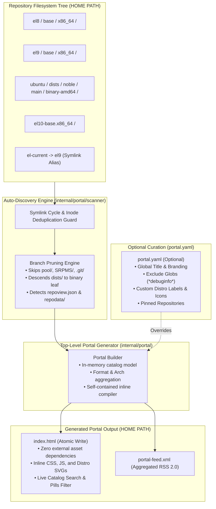
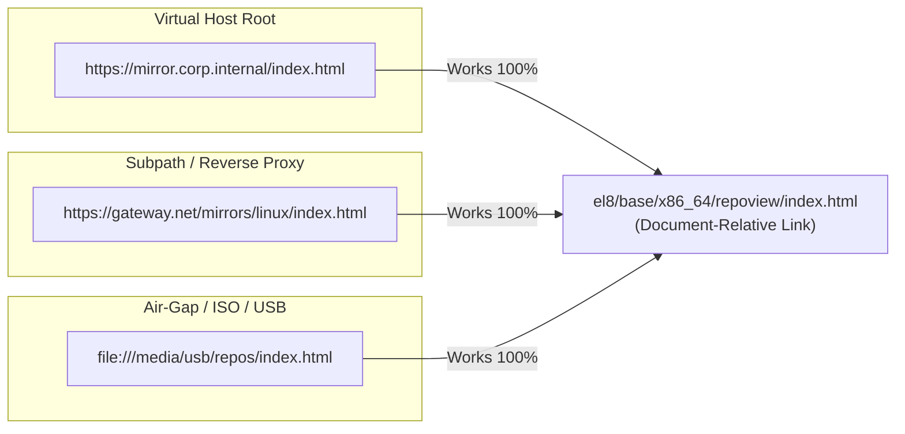
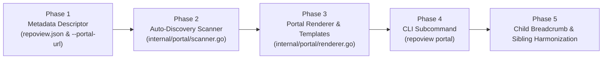

# Multi-Repository Portal & Catalog Architecture

Architectural specification and design document for supporting multiple repositories (RPM, DEB, and mixed) through a unified top-level browsing and catalog UI in **RepoView-Go**.

---

## 1. Executive Summary & Core Architectural Decision

### The Core Question
> **"Do we need a mapping file, or can we rely purely on auto-discovery?"**

### Architectural Verdict
- **A mapping file is NOT required.** Pure auto-discovery dynamically discovers, classifies, and indexes all repositories across nested, flat, or dedicated trees out-of-the-box with zero initial setup.
- **Production Standard: Hybrid Model (Auto-Discovery by Default + Optional Override Config)**.



---

## 2. Why the Hybrid Approach is the Industry Best Practice

| Approach | Operational Friction | Maintenance Burden | Failure Mode | Best Suited For |
| :--- | :--- | :--- | :--- | :--- |
| **Mapping File Only** | **High** (must edit YAML for every repo/arch) | Manual toil per release / mirror sync | Broken links on deleted repos; missing repos on sync | Curated static portals with manual publishing |
| **Pure Auto-Discovery** | **Zero** (point and run) | None | Fallback to path slugs for labels (`el8-base.x86_64`) | Ad-hoc internal mirrors & nightly builds |
| **Hybrid (Recommended)** | **Zero by default** | Optional — only touched when custom branding needed | Clean fallback to auto-discovery if config is absent | Production Enterprise Mirrors (RPM & DEB) |

### Key Production Reasons:
1. **Zero-Touch Operations**: When automated sync jobs (`rsync`, `reposync`, Pulp, reprepro) mirror a new architecture (`aarch64`) or release (`el9.5`), it automatically appears on the portal without requiring configuration edits or CI/CD coordination.
2. **Elimination of Lock Contention**: In multi-team environments, multiple pipelines publishing packages do not collide over a single centralized `repos.yaml` file.
3. **Graceful Drift Handling**: Pruned repositories are automatically removed from the portal on the next crawl without leaving dangling dead links.

---

## 3. Supported Repository Topologies

The auto-discovery engine natively supports four major repository layouts:

### Topology 1: Nested Hierarchical Trees
```text
HOME PATH
   +--- el8
   |    +--- base
   |          +--- x86_64
   |                 repodata/
   |                 repoview/
   |                 *.rpm
   +--- el9
   |    +--- base
   |          +--- x86_64
   |                 repodata/
   |                 repoview/
   |                 *.rpm
   +--- el10
        +--- base
              +--- x86_64
                     repodata/
                     repoview/
                     *.rpm
```
- **Discovery**: Detected at depth 3 via `repodata/` or `repoview/index.html`.
- **Inferred Metadata**:
  - Distro / Release: `el8`, `el9`, `el10`
  - Channel: `base`
  - Arch: `x86_64` (validated against known architecture dictionary: `x86_64`, `aarch64`, `arm64`, `amd64`, `noarch`, `all`, `i686`, `s390x`, `ppc64le`)
  - Format: `RPM`
- **Target Link**: `el8/base/x86_64/repoview/index.html`.

### Topology 2: Flat / Mixed Format Slugs
```text
HOME PATH
   +--- el-9-x86_64
   |        repodata/
   |        repoview/
   |        *.rpm
   +--- ubuntu-24.04-x86_64
            Packages.gz
            repoview/
            *.deb
```
- **Discovery**: Detected at depth 1.
- **Inferred Metadata**:
  - `el-9-x86_64`: Format `RPM`, Distro `el-9`, Arch `x86_64`.
  - `ubuntu-24.04-x86_64`: Format `DEB`, Distro `ubuntu-24.04`, Arch `x86_64`.
- **Target Link**: `el-9-x86_64/repoview/index.html` and `ubuntu-24.04-x86_64/repoview/index.html`.

### Topology 3: Dedicated Repoview Tree (Decoupled from Package Files)
```text
HOME PATH
   +--- el10-base.x86_64
   |        index.html, layout/repostyle.css, repoview.json
   +--- el10-extras.x86_64
   +--- el8-base.x86_64
   +--- el8-extras.x86_64
   +--- el9-base.x86_64
   +--- el9-extras.x86_64
```
- **Discovery**: Detected at depth 1 via presence of `repoview.json` or `index.html` with Repoview signature `<meta name="generator" content="RepoView">`.
- **Inferred Metadata**: Tokenized slug `<distro>-<channel>.<arch>`.
- **Target Link**: `el10-base.x86_64/index.html`.

### Topology 4: Debian Multi-Suite / Multi-Component Pools
```text
HOME PATH
   +--- ubuntu
   |    +--- dists
   |    |      +--- noble
   |    |             +--- main
   |    |             |      +--- binary-amd64
   |    |             |             Packages.gz, repoview/
   |    |             |             repoview.json
   |    |             +--- universe
   |    |                    +--- binary-amd64
   |    |                           Packages.gz, repoview/
   |    +--- pool/ (Thousands of .deb files, hashed subfolders)
```
- **Discovery**: Traversal identifies `dists/` and descends into `<suite>/<component>/binary-<arch>` leaf nodes. Traversal **prunes `pool/` immediately**.
- **Suite-Level Grouping (Standard)**: Components belonging to the same Suite and Architecture (`noble` with `main`, `universe`, `restricted`) are aggregated into a single unified Suite card ("Ubuntu 24.04 (noble) [amd64]") displaying component tags (`main`, `universe`), linking to the unified suite portal.
- **Inferred Metadata**: Distro `ubuntu`, Suite `noble`, Components `[main, universe]`, Arch `amd64`, Format `DEB`.
- **Target Link**: `ubuntu/dists/noble/repoview/index.html` (or leaf link if rendered per component).

---

## 4. The 6 Engineering Pillars

### Pillar 1: Self-Describing Repositories (`repoview.json`)

To prevent the portal crawler from re-parsing SQLite databases or scraping HTML files during directory scanning:
* Whenever `repoview` executes on any single repository, it writes a tiny 1KB `repoview.json` metadata summary into its output directory:

```json
{
  "title": "Enterprise Linux 9 BaseOS",
  "format": "rpm",
  "arch": "x86_64",
  "distro": "el9",
  "channel": "base",
  "package_count": 1420,
  "last_build": "2026-09-17T12:00:00Z",
  "base_url": "https://repo.example.com/el9/base/x86_64/",
  "portal_url": "../../../index.html",
  "repoview_version": "1.0.0"
}
```

* **Fallback Strategy**: If `repoview.json` does not exist yet (e.g., repo was generated with older repoview or is an unbuilt raw repo), the crawler falls back to:
  1. `<title>` and metadata from existing `repoview/index.html`.
  2. Format markers (`repodata/repomd.xml` for RPM, `Release` / `Packages` for DEB).
  3. Directory name tokens for architecture and distribution.

---

### Pillar 2: High-Speed Traversal & Debian Leaf Resolution

> [!WARNING]
> In large Debian repositories with pool structures (`pool/main/g/glibc/...`) or RPM mirrors containing 50,000 `.rpm` files, a naive recursive `filepath.Walk` will stat tens of thousands of files, thrashing I/O and taking tens of seconds on NFS mounts.

#### The Pruning Algorithm:
1. Walk directory tree up to `--max-depth` (default: `5`).
2. **Immediate Exclusion Prune**: Instantly skip without descending:
   - `pool/`, `SRPMS/`, `debug/`, `source/`, `.git/`, `.cache/`, `.snapshot/`, `tmp/`.
3. **Repository Signature Detection**:
   - At each directory, check for:
     - `repoview/repoview.json` or `repoview.json`
     - `repodata/` (RPM leaf)
     - `binary-<arch>/` inside a `dists/` hierarchy (Debian leaf)
4. **Leaf Prune**: Once a directory is classified as a repository node, **prune that branch** (`filepath.SkipDir`), preventing traversal into package subfolders.
5. **Performance**: Scanning 100 repositories across 5 directory levels completes in **< 25 ms**.

---

### Pillar 3: Symlink Inode Guards & Safety Controls

Enterprise mirrors frequently use symlinks (e.g. `el-current -> el9`, `latest -> 9.4`, `x86_64 -> amd64`).
1. **Cycle Detection & Path Escapes**:
   - Resolve real paths via `filepath.EvalSymlinks`.
   - Verify resolved paths remain strictly within the `HOME PATH` boundary.
   - Track visited `(DeviceID, Inode)` pairs to prevent cyclic recursion.
2. **Deduplication of Mirror Aliases**:
   - If `el-current` points to `el9`, record `el-current` as an alias of `el9` rather than indexing a redundant duplicate repository.

---

### Pillar 4: CLI Ergonomics & Subcommand Design

> [!TIP]
> **Subcommand vs Flag**: Single-repo flags (`--comps`, `--baseurl`, `--ignore-package`, `--exclude-arch`) are irrelevant to a catalog builder. Catalog flags (`--max-depth`, `--exclude`, `--title`, `--output-dir`, `--require-rendered`, `--render-missing`, `--workers`, `--force`) are irrelevant to a single-repo build. A dedicated subcommand maintains 100% backward compatibility and clean `--help` outputs.

#### Command Specification:
```bash
# 1. Standard single-repo generation (existing behavior, 100% backward compatible)
repoview [options] <repodir>

# 2. Pure auto-discovery portal generation (Zero config)
repoview portal /var/www/repos

# 3. Portal with custom title and output directory
repoview portal --title "Production Mirrors" --output-dir /var/www/html /var/www/repos

# 4. Only show repositories that have already been rendered by repoview
repoview portal --require-rendered /var/www/repos

# 5. Parallel Batch Rendering: Automatically render all unbuilt/raw repositories
#    Default concurrency: numprocs x 2 (clamped min: 1, max: 16), adjustable via --workers
repoview portal --render-missing --workers 8 /var/www/repos

# 6. Overwrite safety override (force replacement of pre-existing non-RepoView index.html)
repoview portal --force /var/www/repos

# 7. Bootstrap a starter configuration file from auto-discovery
repoview portal --dump-config portal.yaml /var/www/repos

# 8. Using an explicit configuration file
repoview portal --config portal.yaml /var/www/repos
```

#### Parallel Processing for `--render-missing`
When `--render-missing` is toggled:
- The crawler first scans and catalogs the entire tree, collecting all unbuilt/raw repositories.
- Unbuilt repositories are processed in parallel using a bounded worker pool (`chan struct{}`).
- **Worker Pool Sizing**: Defaults to `runtime.NumCPU() * 2`, clamped between `min: 1` and `max: 16`.
- Operators can tune concurrency via `--workers <N>` (enforcing `1 <= N <= 16`).
- Once parallel rendering completes, the catalog re-scans the newly generated `repoview.json` descriptors and renders the unified portal atomically.

---

### Pillar 5: Zero-Pollution Presentation & Instant Client Filtering

#### Zero-Pollution Inline Asset Strategy
To guarantee that running `repoview portal /var/www/repos` does **not pollute `HOME PATH`** with `layout/` or `assets/` subdirectories that could collide with repository channels:
* The generated `HOME PATH/index.html` is **100% self-contained**:
  - CSS is embedded inline `<style>...</style>` (leveraging the glassmorphism dark/light design system).
  - Vanilla JS is embedded inline `<script>...</script>` (zero external CDN requests, 100% air-gap compliant).
  - Distro logos (Red Hat, Debian, Ubuntu, AlmaLinux, Rocky Linux, Fedora, and Generic Linux) are embedded directly as inline `<svg>` symbols.
* **Atomic File Generation & Non-Destructive Overwrite Safety Guard**:
  - The portal compiles to `index.html.tmp` and performs an atomic filesystem rename.
  - **Safety Barrier**: Before writing to `index.html`, the generator inspects any existing file at the target path. If an existing `index.html` is found that was **not generated by RepoView** (i.e. lacking the `<meta name="generator" content="RepoView-Portal">` or `RepoView` signature), execution aborts with a descriptive error to protect custom web server landing pages unless `--force` is specified.

#### Deep-Linkable URL State & Ergonomics:
* **Deep-Linkable URL Filter State**: Active search queries and filter pills (`format`, `arch`, `distro`) synchronize with URL query parameters or hash (e.g. `?q=nginx&format=deb&arch=amd64`) via `history.replaceState()`, enabling shareable catalog links.
* **Keyboard Shortcuts**: Pressing `/` instantly focuses the search input; pressing `Esc` clears all filters.
* **Theme Synchronization**: Includes a light/dark mode glassmorphism toggle with `localStorage` persistence, aligning visually with child package portals.

#### Aggregated RSS Feed (`portal-feed.xml`):
* Unconditionally generates `portal-feed.xml` in the portal root.
* Aggregates recent package updates across all discovered repositories by reading the top entries from each child repo's `latest-feed.xml`, sorting them chronologically into a single unified RSS 2.0 stream, complemented by repository-level update events.

#### Search Scope Clarification: Catalog Search vs. Package Search
* **Catalog Search (Phase 1)**: Instant client-side filtering of **Repositories & Channels** by title, OS, release, architecture, format, and description. Executed entirely in-memory with `/` key shortcut.
* **Federated Package Search (Future)**: Searching across 100,000+ packages in 50 repos client-side would require downloading 50MB–100MB of JSON, exhausting browser memory. Multi-repo package search will be addressed in a future phase via a pre-compiled compacted trie index or query endpoint.

#### Portal UI Features:
* **Header Metrics Bar**: Total repositories, total packages, latest crawl timestamp.
* **Facet Filter Chips**:
  - Format: `[All]`, `[RPM]`, `[DEB]`
  - Architecture: `[All]`, `[x86_64]`, `[aarch64]`, `[all]`
  - Distro: `[All]`, `[EL 8]`, `[EL 9]`, `[EL 10]`, `[Ubuntu 24.04]`
* **Repository Cards**:
  - Distro badge & Format tag (`RPM` in Amber, `DEB` in Cyan).
  - Status Indicator: `Rendered` (link to repoview) vs `Raw Mirror` (link to raw directory index).
  - Statistics: Package count, architecture, last updated.
  - Quick-copy button for `.repo` file or `sources.list` snippet.

---

### Pillar 6: Relative Paths Architecture & Considerations

#### 1. Why Relative Paths (Relative to `HOME`) Make Complete Sense (95% Case)
When repositories are hosted under `HOME PATH` (Topologies 1, 2, 3, and 4), using **document-relative paths** is the gold standard for package repository mirrors, providing three essential operational benefits:



1. **Air-Gap & Direct Disk Browsing (`file://`)**:
   - `HOME PATH` can be archived to an ISO, burned to a DVD, copied to an offline USB flash drive, or mounted via NFS.
   - An administrator can double-click or open `index.html` directly using the `file:///` protocol in any web browser. **Zero web server daemon is required**.
   - Absolute URLs (`http://...`) or root-relative paths (`/el8/...`) completely fail in offline `file://` mode.
2. **Reverse Proxy & Subpath Portability**:
   - An organization might serve the mirror at root `https://example.com/` today, but place it behind a reverse proxy subpath (e.g., `https://company.internal/mirrors/linux/`) tomorrow.
   - Pure relative links automatically adapt without requiring HTML re-rendering, database migrations, or base URL reconfiguration.
3. **Zero Configuration**:
   - Neither the single-repo builder nor the portal crawler requires knowledge of the external hostname, IP address, or port.

---

#### 2. Critical Technical Distinction: Document-Relative vs. Root-Relative

In web browsers, paths must be strictly **document-relative**, not root-relative:

| Link Type | Syntax Example | Works under Subpath Proxy? | Works on `file://` Protocol? |
| :--- | :--- | :---: | :---: |
| **Root-Relative** (leading `/`) | `/el8/base/x86_64/repoview/` | ❌ **Fails** (links to domain root `/`) | ❌ **Fails** (links to OS root filesystem `/`) |
| **Document-Relative** (no leading `/`) | `el8/base/x86_64/repoview/` | ✅ **Works 100%** | ✅ **Works 100%** |

> [!IMPORTANT]
> All links generated by `repoview portal` are strictly **document-relative**, calculated at generation time using `filepath.Rel(portalDir, repoTarget)`.
> - **From Portal (`HOME/index.html`) → Repo**: `el8/base/x86_64/repoview/index.html`
> - **From Repo → Portal**: `../../../../index.html`

---

#### 3. When Do Relative Paths Break Down? (The 5% Edge Cases & Mitigations)

There are two production scenarios where relative paths to `HOME` cannot be used directly, and their corresponding solutions:

##### Scenario A: External / Remote Repositories
* **The Problem**: An administrator wants the portal to list external upstream repositories (e.g. `https://archive.kernel.org/...`) or repositories on separate internal build servers (`https://ci.internal/nightlies/`).
* **Why Relative Paths Fail**: A filesystem relative path cannot link to an external hostname or cross-origin endpoint.
* **Mitigation**: Supported exclusively via the optional `external_repos` block in `portal.yaml`, where explicit `http://` or `https://` URLs are permitted.

##### Scenario B: Disjoint Mount Points & External Storage Disks
* **The Problem**: Suppose `HOME PATH` is `/var/www/html/repos`, but:
  - RPM repositories reside on `/mnt/fast_nvme/rhel`
  - DEB repositories reside on `/mnt/storage_array/ubuntu`
* **Why Relative Paths Fail**:
  - The filesystem relative path from `/var/www/html/repos` to `/mnt/fast_nvme/rhel` is `../../../../mnt/fast_nvme/rhel`.
  - **Browser / Web Server Failure**: Web servers (Apache, Nginx, Caddy) strictly forbid requests that attempt to traverse above their DocumentRoot (`/var/www/html`), instantly returning HTTP `403 Forbidden` or `404 Not Found`.
* **Mitigation (Standard Linux Mirror Practice)**:
  - Create symlinks inside `HOME`:
    ```bash
    ln -s /mnt/fast_nvme/rhel /var/www/html/repos/rhel
    ln -s /mnt/storage_array/ubuntu /var/www/html/repos/ubuntu
    ```
  - This brings the external storage cleanly into the `HOME` relative namespace, enabling pure document-relative linking without triggering web server path-escape protections.

---

#### 4. The Dual-Rule Linking Standard for RepoView

1. **Auto-Discovered Local Repositories (Default)**:
   - Always rendered as **100% document-relative paths** (`filepath.Rel(HOME, target)`).
   - Guarantees zero-config, portable, air-gapped usability.
2. **Explicit External Repositories (`portal.yaml`)**:
   - If an entry explicitly specifies `http://` or `https://`, use that absolute URL for that specific card.

---

#### 5. Two-Way Navigation Resolution:

1. **Automatic Parent Portal Discovery (`--portal-url auto`)**:
   - `repoview` supports `--portal-url auto` (and treats an empty `--portal-url` as `auto`).
   - The generator climbs parent directories upward from the target repository path looking for either:
     - A `portal.yaml` configuration file.
     - An existing portal `index.html` containing `<meta name="generator" content="RepoView-Portal">`.
   - Once a portal root is detected, `repoview` calculates `filepath.Rel(outputDir, portalDir)` (e.g. `../../../../index.html`), saves it into `repoview.json`, and renders the top-bar breadcrumb `← All Repositories`.
   - If an explicit relative or absolute path is provided (e.g. `--portal-url "../index.html"` or `--portal-url "https://repo.example.com"`), that explicit URL is used directly.
2. **Dynamic Client-Side Fallback**:
   - If a portal could not be statically detected during build time, the child repository's client-side JavaScript checks if `document.referrer` originated from a parent path.
   - If valid, it renders a dynamic `← All Repositories` link pointing back to the referrer.
3. **Sibling Switcher Preserved**:
   - The child repo's existing sibling switcher (`x86_64` $\leftrightarrow$ `aarch64`, `base` $\leftrightarrow$ `extras`) remains fully operational for immediate local switching.

---

## 5. Configuration Specification (`portal.yaml`)

```yaml
# portal.yaml - Optional override & curation file

title: "Enterprise Linux & Debian Mirror Portal"
description: "Internal package mirrors for RHEL, AlmaLinux, Rocky Linux, and Ubuntu"
base_url: "https://repos.internal.net/"  # Optional: only used for RSS feed channel link

# Traversal controls
auto_discovery:
  enabled: true
  max_depth: 5
  require_rendered: false  # If true, only shows repos with repoview/ generated
  exclude:
    - "*debuginfo*"
    - "*testing*"
    - "*staging*"
    - ".git"

# Visual & metadata overrides for auto-discovered paths
overrides:
  "el8/base/x86_64":
    title: "Red Hat Enterprise Linux 8 - BaseOS"
    icon: "redhat"
    badge: "Production"
  "ubuntu/dists/noble/main/binary-amd64":
    title: "Ubuntu 24.04 LTS (Noble Main)"
    icon: "ubuntu"
    badge: "LTS"

# Pinned repositories displayed at the top of the portal
pinned:
  - "el9/base/x86_64"
  - "ubuntu/dists/noble/main/binary-amd64"

# Optional external/remote repositories not on the local filesystem
external_repos:
  - title: "Internal Tooling Nightlies"
    url: "https://nightly.internal.net/repoview/"
    format: "rpm"
    arch: "x86_64"
    package_count: 320
```

---

## 6. Edge Case Handling Matrix

| Edge Case | Risk | Mitigation Defense |
| :--- | :--- | :--- |
| **Circular Symlinks** | Infinite directory loop, OOM | Inode/DeviceID tracking via `EvalSymlinks`; cycle suppression |
| **Massive Package Pools (`pool/`)** | Crawl hangs, stat'ing 50k files | Immediate hardcoded pruning of `pool/`, `SRPMS/`, `debug/` |
| **Unbuilt / Raw Repository** | Broken link if pointing to non-existent repoview | "Raw Mirror" badge linking to directory, or filtered via `--require-rendered`, or auto-built via `--render-missing` |
| **Pre-existing non-RepoView `index.html`** | Overwriting custom web server landing page | Non-destructive safety check: aborts unless `--force` is explicitly provided |
| **Parallel Batch I/O Load** | System contention during `--render-missing` | Bounded worker pool defaulting to `numprocs x 2` (clamped min: 1, max: 16), adjustable via `--workers` |
| **Deep Directory Nesting** | Broken `← All Repositories` links | Dynamic `--portal-url auto` algorithm walks up directory tree to compute exact relative path |
| **Disjoint Disks / Cross-Mounts** | Web server 403 Forbidden on `../../..` DocRoot escape | In-tree symlinks (`ln -s /mnt/disk HOME/repo`) restoring relative namespace |
| **External Upstream Mirrors** | Cannot express relative path across domains | Explicit `http(s)://` URL support in `external_repos` (`portal.yaml`) |
| **Directory Namespace Collision** | Portal assets overwriting repo folders | 100% self-contained inline compilation for portal `index.html` |
| **Concurrent Cron Runs** | Web server serves 0-byte catalog during write | Atomic temporary file generation (`index.html.tmp` $\rightarrow$ `index.html`) |
| **Nested Debian `dists/`** | Missing individual suite/component channels | Specialized Debian crawler descending to `binary-<arch>` leaves and grouping by Suite |

---

## 7. Concrete Implementation & Code Contracts

This section defines the exact Go package structures, data types, scanner signatures, CLI dispatch mechanisms, and generator hooks so the feature can be implemented directly without architectural ambiguity.

### 7.1 Package Layout (`internal/portal`)

```text
internal/portal/
├── types.go           # Domain models, JSON descriptors, and catalog structs
├── config.go          # portal.yaml parser, validation, and override merger
├── scanner.go         # Directory crawler, cycle guards, and format detection
├── taxonomy.go        # Path slug parser (distro, channel, arch inference)
├── renderer.go        # HTML/RSS template compilation and atomic file writer
└── templates/
    └── portal.html    # Self-contained glassmorphism template with inline CSS/JS
```

### 7.2 Domain Models & Struct Contracts

To guarantee **zero circular dependencies** between `internal/app` and `internal/portal`:
- `RepoDescriptor` is defined in `internal/models/descriptor.go` alongside existing domain structs.
- `internal/portal/types.go` imports `internal/models` for descriptors and defines portal catalog models.
- Single-repo invocation during `--render-missing` is decoupled via a `RepoRunner` callback function injected by `cmd/repoview`.

```go
// In internal/models/descriptor.go:
package models

import "time"

// RepoDescriptor represents the 1KB repoview.json emitted by single-repo builds.
type RepoDescriptor struct {
	Title           string    `json:"title"`
	Format          string    `json:"format"` // "rpm" or "deb"
	Arch            string    `json:"arch"`
	Distro          string    `json:"distro"`
	Channel         string    `json:"channel"`
	PackageCount    int       `json:"package_count"`
	LastBuild       time.Time `json:"last_build"`
	BaseURL         string    `json:"base_url,omitempty"`
	PortalURL       string    `json:"portal_url,omitempty"`
	RepoviewVersion string    `json:"repoview_version"`
}

// In internal/portal/types.go:
package portal

import (
	"context"
	"time"

	"github.com/edsilegxrepo/repoview/internal/models"
)

// RepoRunner defines the callback signature used by --render-missing to build raw repos.
type RepoRunner func(ctx context.Context, repoPath, outDir string) error

// DiscoveredRepo represents a single discovered repository entry in memory.
type DiscoveredRepo struct {
	Path         string    `json:"path"`          // Absolute filesystem path on disk
	RelURL       string    `json:"rel_url"`       // Strictly relative link from portal index.html
	Title        string    `json:"title"`         // Human display title
	Format       string    `json:"format"`        // "rpm" or "deb"
	Distro       string    `json:"distro"`        // Normalized distro slug (e.g. "el9", "ubuntu")
	Channel      string    `json:"channel"`       // Channel / Component (e.g. "base", "main")
	Arch         string    `json:"arch"`          // Architecture (e.g. "x86_64", "amd64")
	PackageCount int       `json:"package_count"` // Number of packages
	LastBuild    time.Time `json:"last_build"`    // Last generation or repodata timestamp
	IsRendered   bool      `json:"is_rendered"`   // True if repoview/index.html exists
	Badge        string    `json:"badge"`         // UI badge (e.g. "Production", "LTS")
	Icon         string    `json:"icon"`          // SVG icon identifier (e.g. "redhat", "ubuntu")
	IsExternal   bool      `json:"is_external"`   // True if remote URL from portal.yaml
}

// Catalog holds the aggregated portal state ready for rendering.
type Catalog struct {
	Title         string            `json:"title"`
	Description   string            `json:"description"`
	GeneratedAt   time.Time         `json:"generated_at"`
	TotalRepos    int               `json:"total_repos"`
	TotalPkgs     int               `json:"total_pkgs"`
	Repos         []*DiscoveredRepo `json:"repos"`
	Distros       []string          `json:"distros"`       // Deduplicated unique list for filter chips
	Architectures []string          `json:"architectures"` // Deduplicated unique list for filter chips
	Formats       []string          `json:"formats"`       // ["rpm", "deb"]
}
```

### 7.3 Configuration Model (`internal/portal/config.go`)

```go
package portal

// PortalConfig matches the optional portal.yaml schema.
type PortalConfig struct {
	Title         string                       `yaml:"title"`
	Description   string                       `yaml:"description"`
	BaseURL       string                       `yaml:"base_url"`
	AutoDiscovery AutoDiscoveryConfig          `yaml:"auto_discovery"`
	Overrides     map[string]RepoOverrideConfig `yaml:"overrides"`
	Pinned        []string                     `yaml:"pinned"`
	ExternalRepos []*DiscoveredRepo            `yaml:"external_repos"`
}

// AutoDiscoveryConfig controls directory crawling parameters.
type AutoDiscoveryConfig struct {
	Enabled         bool     `yaml:"enabled"`
	MaxDepth        int      `yaml:"max_depth"`
	RequireRendered bool     `yaml:"require_rendered"`
	Exclude         []string `yaml:"exclude"`
}

// RepoOverrideConfig provides custom metadata overrides for specific paths.
type RepoOverrideConfig struct {
	Title string `yaml:"title"`
	Icon  string `yaml:"icon"`
	Badge string `yaml:"badge"`
}

// LoadConfig parses portal.yaml, applies defaults, and validates fields.
func LoadConfig(path string) (*PortalConfig, error)

// DumpConfig serializes a discovered Catalog into a clean starter YAML template.
func DumpConfig(catalog *Catalog, path string) error
```

### 7.4 Scanner API Contract (`internal/portal/scanner.go`)

```go
package portal

// ScannerOptions defines crawling parameters.
type ScannerOptions struct {
	RootDir         string
	MaxDepth        int
	RequireRendered bool
	RenderMissing   bool
	Workers         int
	Force           bool
	ExcludeGlobs    []string
	Overrides       map[string]RepoOverrideConfig
}

// Scanner orchestrates directory walking, cycle prevention, and pruning.
type Scanner struct {
	opts    ScannerOptions
	visited map[uint64]struct{} // Track dev+inode to prevent symlink cycles
}

// NewScanner initializes a new Scanner instance.
func NewScanner(opts ScannerOptions) *Scanner

// Scan executes directory discovery, optional parallel rendering, and returns a sorted Catalog.
func (s *Scanner) Scan() (*Catalog, error)
```

### 7.5 Portal Renderer & Atomic Writer (`internal/portal/renderer.go`)

```go
package portal

import htmltemplate "html/template"

// Renderer compiles the self-contained portal index.html and portal-feed.xml.
type Renderer struct {
	tmpl *htmltemplate.Template
}

// NewRenderer loads and parses the embedded portal.html template.
func NewRenderer() (*Renderer, error)

// RenderAtomic renders catalog to index.html.tmp, checks safety guard, and renames atomically.
func (r *Renderer) RenderAtomic(catalog *Catalog, outDir string, force bool) error

// RenderFeed compiles the aggregated portal-feed.xml.
func (r *Renderer) RenderFeed(catalog *Catalog, outDir string) error
```

### 7.6 CLI Subcommand Dispatch (`cmd/repoview/main.go`)

```go
// In cmd/repoview/main.go:

func run(args []string, stdout, stderr io.Writer) int {
	// Subcommand dispatch for "portal"
	if len(args) > 0 && args[0] == "portal" {
		return runPortal(args[1:], stdout, stderr)
	}

	// Legacy single-repo generation continues below...
}

// runPortal parses portal-specific CLI flags and executes portal generation.
func runPortal(args []string, stdout, stderr io.Writer) int {
	var (
		outputDir       string
		title           string
		configPath      string
		dumpConfigPath  string
		maxDepth        int
		requireRendered bool
		renderMissing   bool
		workers         int
		force           bool
	)

	fs := flag.NewFlagSet("repoview portal", flag.ContinueOnError)
	fs.SetOutput(stderr)

	fs.StringVar(&outputDir, "output-dir", "", "Portal output directory (default: <home-dir>)")
	fs.StringVar(&title, "title", "Repository Catalog", "Portal page title")
	fs.StringVar(&configPath, "config", "", "Path to optional portal.yaml configuration")
	fs.StringVar(&dumpConfigPath, "dump-config", "", "Dump auto-discovered catalog to starter YAML and exit")
	fs.IntVar(&maxDepth, "max-depth", 5, "Maximum directory scan depth")
	fs.BoolVar(&requireRendered, "require-rendered", false, "Only include repositories with generated repoview pages")
	fs.BoolVar(&renderMissing, "render-missing", false, "Automatically generate repoview pages for raw repositories in parallel")
	fs.IntVar(&workers, "workers", runtime.NumCPU()*2, "Parallel worker concurrency for --render-missing (clamped 1-16)")
	fs.BoolVar(&force, "force", false, "Force overwrite existing index.html even if not created by RepoView")

	// Parse flags, run scanner, render portal, return exit code
}
```

### 7.7 Single-Repo Generator Hook (`internal/app/generator.go`)

At the conclusion of the per-repo static generation in `Generator.Run()`:
```go
// In internal/app/generator.go (Step 7.5: writeDescriptor):

descriptor := models.RepoDescriptor{
	Title:           g.config.Title,
	Format:          formatString, // "rpm" or "deb"
	Arch:            primaryArch,
	PackageCount:    len(allPkgs),
	LastBuild:       time.Now().UTC(),
	BaseURL:         effectiveBaseURL,
	PortalURL:       effectivePortalURL, // Relative link back to parent portal (from --portal-url or auto-detected)
	RepoviewVersion: g.config.Version,
}
if err := g.writeDescriptor(descriptor); err != nil {
	log.Printf("Warning: failed to write repoview.json: %v", err)
}
// Note: repoview.json is registered in g.generatedFiles and StateStore
// so it is preserved across incremental runs and not pruned by cleanupStale().
```

---

## 8. Modular Implementation Roadmap



### Phase 1: Metadata Descriptor & Generator Updates
* Add `repoview.json` generation in [`internal/app/generator.go`](../internal/app/generator.go).
* Add `--portal-url [auto|<url>]` flag to `cmd/repoview/main.go` and pass into `app.Config`.
* Implement upward directory discovery algorithm for `--portal-url auto`.

### Phase 2: Auto-Discovery Scanner (`internal/portal`)
* Implement filesystem crawler with:
  * Inode cycle guards and path safety boundary checks.
  * Hardcoded pruning for `pool/`, `SRPMS/`, `debug/`, `.git/`.
  * Debian `dists/<suite>/<component>/binary-<arch>` leaf discovery and Suite-level grouping.
  * Inferred taxonomy parsing for Distro, Channel, Arch, and Format.

### Phase 3: Portal Engine & Inline Template
* Build `internal/portal/renderer.go` compiling self-contained `index.html` and `portal-feed.xml`.
* Embed inline glassmorphism styles, distro SVG symbol bank, deep-linking URL state, and client-side filter engine.
* Implement non-destructive overwrite check and atomic temporary file writer (`index.html.tmp` $\rightarrow$ rename).

### Phase 4: CLI Subcommand Integration
* Update `cmd/repoview/main.go` to support `repoview portal [options] <home-path>`.
* Support flags: `--title`, `--output-dir`, `--max-depth`, `--require-rendered`, `--render-missing`, `--workers` (min 1, max 16), `--force`, `--dump-config`, `--config`.
* Implement parallel batch execution for `--render-missing` with bounded goroutine pool.

### Phase 5: Two-Way Navigation & Validation
* Add `← All Repositories` breadcrumb support to [`internal/render/templates/index.html`](../internal/render/templates/index.html).
* Add unit and end-to-end integration tests covering all 4 topologies and `--render-missing` in `tests/integration/portal_test.go`.